# AOC architecture

AOC (Agent Ops Console) wraps Claude Code sessions in a governed, audited and metered project-lifecycle platform.
This document describes how the platform is put together and why. The binding requirements are in
[AOC-SPEC-003](spec/AOC-SPEC-003.md). The shared types, event catalog and service interfaces in
[`packages/contracts/src`](../packages/contracts/src) are the source of truth for every name used below. Where this
document and the contracts disagree, the contracts win; please fix this document.

Related documents:

- Decisions and their trade-offs: [Architecture Decision Records](adr/README.md)
- Security: [threat model and risk register](security/threat-model.md)
- Operations: [runbooks](runbooks/operations.md), including [credential isolation (R1)](runbooks/credential-isolation.md),
  [key custody (R6)](runbooks/key-custody.md), [anchoring (R2)](runbooks/anchoring.md),
  [observed sessions](runbooks/observed-sessions.md) and [incident and break-glass](runbooks/incident-break-glass.md)
- Governance: [self-modification boundary (§13)](compliance/self-modification-boundary.md)
- Verified Claude Code behaviour: [docs/research/claude-code-integration.md](research/claude-code-integration.md)
- Spec coverage: [traceability matrix](compliance/traceability.md) and [gap list](compliance/gaps.md)

**Status legend.** This document was written on 2026-10-09 and last brought up to date at integration commit
`a1c8a0c`. **Built** means implemented and tested in the repository at that commit (not yet independently
reviewed; see §17). **Contracted** means the events, configuration and service interfaces are fixed in
`packages/contracts`, and the implementation is being built in parallel. Treat every Contracted behaviour as a
requirement until its module lands.

---

## 1. Context: three roles, two surfaces, one engine

One engine, one audit log, and a per-person identity layer underneath all of it (§6).

| Role | Who | Surface | Holds |
| --- | --- | --- | --- |
| Approver | The CEO | Operator console and CLI | The gates: fix-plan sign-off, go-live, rollback, break-glass, playbook and lesson binding, credit top-ups, FX discrepancies |
| Builder | Developers | Operator console and CLI | Drives managed sessions. Self-approves reversible off-main work. Anything touching main, production or data bounces to the Approver |
| Requester | End users | Intake portal | Files bugs with video, image and comment. Tests fixes on UAT. Sees abstracted status only |

The unit of work is the **project** (§1). A project lives across many disposable **sessions** under a durable
**project thread**. Only build activity is first-class progress: a plan declared, a task done with evidence, a phase
completed, a decision, drift, an enhancement or a rollback. Questions and answers are logged, but they never count
as progress.

## 2. Components

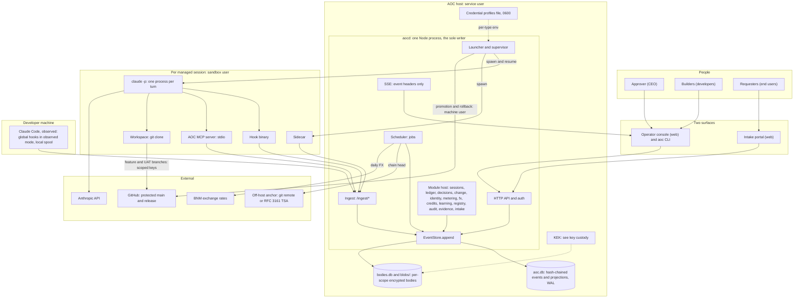

| Component | Package | What it does | Status |
| --- | --- | --- | --- |
| **aocd** | `packages/daemon` | Composition root. One process hosts the HTTP API, ingest, SSE, the job scheduler, every domain module and the launcher/supervisor. It is the **sole writer** of the event log. | Built |
| **Kernel** | `packages/kernel` | `EventStore` (hash chain, idempotency, projections, rebuild, verification, crypto-shred), `BodyStore` (per-scope envelope encryption, blobs), module host (`AocRuntime`), guard policy, broadcaster, reactor bus, job scheduler, git wrapper, test kit. | Built |
| **Launcher / supervisor** | `packages/supervisor` | Spawns `claude -p` per turn with the AOC hooks, the AOC MCP server, the env allowlist and the process type's credential profile. Resumes, nudges, restarts, stops, rolls over, and runs isolated verification commands. | Built |
| **Per-session sidecar** | `packages/sidecar` | Started by the supervisor next to each managed session. Heartbeats from the process (hooks cannot fire while the model generates, §2.1). Tails the transcript and subagent transcripts for per-message usage (deduplicated by `message.id`) and plan-limit hits. Spools when aocd is down. Reports with its own `sidecar` token, never the session's (G-44). | Built |
| **AOC MCP server** | `packages/mcp-server` | The agent's structured voice (§2). Eight schema-validated tools, relayed verbatim to `/ingest/mcp/<tool>`. Refuses to start without a session id, daemon URL and ingest token. Never retries writes. | Built |
| **Hooks** | `packages/hooks` | A thin relay from Claude Code hook events to `/ingest/hook`. The daemon decides the effect; the hook only applies it (ADR-0004). Managed mode fails closed. Observed mode never blocks and spools locally. | Built |
| **Ingest client** | `packages/client` | Timeouts, bounded retries and a local JSONL spool replayed through `/ingest/spool` (idempotent). Shared by the hooks, sidecar, MCP server and CLI. | Built |
| **Domain modules** | `packages/mod-*` | Each exports an `AocModule`: events, projectors, reactors, guards, routes, jobs and services. Modules depend only on the service interfaces in `contracts/services.ts`, never on each other's code. | Built, except `mod-tower`, which is Contracted |
| **Control Tower** | `packages/mod-tower` | The Approver's landing view: an exception-first attention queue ranked by cost of delay, plus flow, fleet, spend, integrity and a portfolio-level anomaly radar (`TowerSnapshot` in [`dto/tower.ts`](../packages/contracts/src/dto/tower.ts)). Never ranks people (R11). | Contracted |
| **Web** | `packages/web` | The operator console and the intake portal: React, infographic-first (§12, ADR-0011). One token set for light and dark. Built to the static mock [`mocks/aoc-mock.html`](../mocks/README.md), which the CEO approved on 2026-10-09 with its proposed defaults. | In progress (shell, pages and charts landed) |
| **Demo seeder** | `packages/demo` | Deterministic demo history for walkthroughs and UI work. It writes `<dataDir>/aoc.config.json`, which runs managed sessions on `claude-sim` with the fake LLM extractor and the FX job off: demos never call the real `claude` CLI. | Built |
| **CLI** | `packages/cli` | `aoc`: `login`, `project create`, `run --type …`, `sessions`, `decisions` and `decide`, `hooks install-observed`, `doctor`, `audit verify` / `anchor` / `evidence`, `serve`. | Built |
| **claude-sim** | `packages/claude-sim` | Deterministic fake `claude` CLI for end-to-end tests and demo data. Tests never call the real binary. | Built |
| **LLM adapters** | `packages/llm` | Structured JSON extraction (Claude CLI, Anthropic SDK, fake) for FX scraping, triage reconciliation and change-record drafting. | Built |

### 2.1 aocd: the sole writer

Hooks fire concurrently. If each hook appended to the database itself, two writers could read the same chain head
and fork the chain (§15.1). So **only aocd writes**. `EventStore.append()` runs synchronously on `node:sqlite`
(`BEGIN IMMEDIATE` … `COMMIT`) inside one Node event loop, so appends are strictly serialised. Hooks, the MCP
server, the sidecar, the CLI and the browser never open the database. They call the API or `/ingest/*`
(ADR-0001, ADR-0002).

aocd's parts:

- **HTTP API** (Hono). Users authenticate with a bearer token or the `aoc_session` cookie. Every route checks a
  permission from [`roles.ts`](../packages/contracts/src/roles.ts). Errors use one envelope:
  `{ error: { code, message, details? } }`.
- **Ingest** (`INGEST_PATHS` in [`ingest.ts`](../packages/contracts/src/ingest.ts)): `/ingest/hook`,
  `/ingest/spool`, `/ingest/heartbeat`, `/ingest/activity`, `/ingest/usage`, `/ingest/throttle`,
  `/ingest/process` and `/ingest/mcp/<tool>`. Ingest uses separate principals (§15): per-session tokens (valid only
  for their own session), a per-session sidecar token (the only principal that reports a managed session's
  heartbeats, activity, usage, throttles and process exit), an observer token (observed events only) and system
  tokens. A request without a valid ingest token is refused (401) **before any body is parsed**, and observed-mode
  events can never target a managed session.
- **Request limits.** Every body is capped before authentication or parsing: 64 MiB for the spool, 16 MiB for
  other ingest, 4 MiB for the API, and the intake total allowance plus 1 MiB for the portal (one maximum-size video,
  `intake.maxVideoBytes`, the same total `GET /portal/api/limits` publishes). A larger body gets 413.
  A single huge request therefore cannot stall the sole writer, and with it every managed session's hooks.
- **SSE.** Event headers, liveness changes, notifications and activity ticks. Never bodies (§5.8).
- **Scheduler.** Interval jobs and daily jobs at a local time in `config.timezone` (default
  `Asia/Kuala_Lumpur`). Daily jobs run once per local date. Examples: the FX fetch, the metering day close, the
  anchor and the intake diagnosis-budget sweep.
- **Module host** (`AocRuntime`). Projectors are registered first, and new, changed or degraded projections are
  rebuilt from the log (§5.6). Then `init` runs (modules provide services), routes are mounted, `start` runs (all
  services are available), reactors catch up and jobs start.

### 2.2 Launcher and supervisor

The supervisor is a module inside aocd (`SupervisorService` in
[`services.ts`](../packages/contracts/src/services.ts), implemented in `packages/supervisor`). It owns every
`claude` process.

- **Launch** (`aoc run --type <processType>`, the console, or the intake flow). The process type comes from the
  fixed registry ([`config/process-types.json`](../config/process-types.json)). The model comes from
  `routeModel()`, never from the agent (§2.2, ADR-0005). A launch for a type the registry does not list is refused
  (422 `unknown_process_type`), and so is one for a project the ledger does not know (404 `unknown_project`): a
  launch never creates a project, and a refused launch appends nothing (its idempotency key, if it has one, stays
  free). The supervisor opens or continues the thread and takes its
  single writer lock, checks credits at the launch boundary, issues a per-session ingest token, appends
  `session.launch_requested`, and prepares a private session directory with the system prompt, `mcp.json` and
  `settings.json` (files written 0600).
- **The command line** (verified against Claude Code 2.1.295): `claude -p --output-format stream-json --verbose
  --include-partial-messages --mcp-config <mcp.json> --strict-mcp-config --settings <settings.json>
  [--permission-mode <mode>] --append-system-prompt <AOC prompt> [--tools <built-in set>] --allowedTools mcp__aoc …
  [--disallowedTools …] --session-id|--resume <uuid> --model <model> -- <prompt>`. The prompt goes last, after
  `--`, because the variadic tool flags would otherwise swallow it.
- **Hook settings** are generated and checked against a strict schema **before** they are written, because Claude
  Code silently ignores invalid settings in `-p` mode. There is one command hook per event, and the command line
  carries no secret.
- **MCP config** declares the `aoc` server with `alwaysLoad: true`. If `system/init` does not report `aoc` as
  `connected`, the supervisor aborts the turn and fails the session ("fail loudly").
- **Environment.** Only `supervisor.envAllowlist` variables cross from aocd, and never an `AOC_*` one. The supervisor
  adds `TZ` and the session's own `AOC_*` values. Only the `session` part of a credential profile (read-only
  values; never a key that can push) is added, and only when the type names a profile and is not read-only. The
  profile's `env` and `files` are the push credential and stay with aocd: a session with `push.refs` gets git
  settings that make remote `aoc` the push gateway instead (below). Read-only types also get every file-changing
  tool disallowed, whatever the registry says.
- **Sidecar.** Started with the session id, the `claude` pid, the transcript path and the daemon URL. Its ingest
  token travels in the environment, never in argv, because a command line is readable by every local user.
- **End of a turn** (one process is one turn), checked in this order: an open decision → `waiting_decision`; a
  plan-limit signal → `throttled`; the credit cap reached at a boundary → `blocked`; a stop request → ended; the plan
  complete → ended `completed`; a rollover due at a clean boundary → rollover; a crash without a `result` → failed
  (Dead, restartable). A read-only triage type (registry class `triage`, `readOnly`, e.g. `bug-triage`) ends at its
  diagnosis: once the session's `report_diagnosis` is on record (`ticket.diagnosis_reported`), its turn end ends it
  `completed` (reason `diagnosis_reported`), whatever its plan says, because the triage prompt asks for a diagnosis
  and never for `task_done`; a triage turn that ends without one is handled like any other. Otherwise an answer that
  arrived during the turn is delivered now, or the session
  auto-continues (`autoContinueLimit`, default 1), or it goes `idle` (Waiting on you) with a notification. Every turn
  end is recorded as `session.turn_ended {outcome}`.
- **Resume** with `claude -p --resume <uuid>` and the same flags:
  - a reactor on `decision.resolved` and `decision.withdrawn` resumes a waiting session once none of its decisions
    is still open; each answer is injected exactly once (`decision_answered`);
  - a reactor on `credit.topup_granted` resumes the owner's sessions that were blocked on the cap (`topup`);
  - the job `supervisor.throttle_resume` (every 30 s) resumes throttled sessions once their reset time has passed,
    or 30 minutes after the hit when no reset time is known, and records `throttle.cleared {idleMs}`
    (`throttle_reset`).
- **Operator actions.** **Nudge** interrupts the running turn and resumes with the operator's text. **Restart**
  resumes a dead or stalled session from its transcript. **Stop** ends the session at the next task boundary
  (`task_done` returns `stop_requested`), or at once.
- **Startup recovery.** A session recorded as running whose process is gone gets a `crashed` turn and is marked
  failed (Dead, restartable). An orphaned process left by a previous daemon is interrupted. Queued launches start
  again, and a decision answered just before a crash is delivered. Waiting, throttled and blocked sessions stay as
  they are. On shutdown, running turns are interrupted, and the next start marks them Dead.
- **Rollover** to a fresh session with a deterministic handoff brief, only at a clean task boundary (§14, ADR-0008).
- **`runIsolated`** runs rollback verification and promotion commands with an allowlisted environment plus, for
  promotion, the promotion credential profile. It is never exposed to agents.
- **Push gateway** (§3, R-02). A session pushes with `git push aoc <commit>:refs/heads/<branch>`; remote `aoc` is
  `<publicUrl>/ingest/git/<project>.git`, git's smart HTTP served by the supervisor's routes under the ingest
  prefix, authenticated by the session's ingest token and accepted only while one of its turns runs. aocd receives
  the push into a service-owned bare repository (`<dataDir>/git/<project>.git`), refuses the whole push if any ref
  is `main`, `master`, `production`, `release/*`, a tag, a deletion or outside the profile's `push.refs`, and forwards
  the rest to the `origin` an operator set on that repository, through `runIsolated` with the profile's credential.
  Every push is a `session.git_pushed` event. See the [runbook](runbooks/credential-isolation.md) §4, item 11.

Not in place yet (see the [threat model](security/threat-model.md)): sessions and `runIsolated` still run as aocd's
own OS user and inherit its `HOME` (O-1, O-2); there is no "no `SessionStart` hook within N seconds" launch check
(O-15); and Claude Code's auto-compaction threshold is not aligned with the rollover threshold (ADR-0008).

### 2.3 Per-session sidecar

Hooks fire on events, not on a clock, and nothing fires while the model is generating. That is exactly when
Thinking must be told apart from Stalled (§2.1). The sidecar fills that gap:

- It sends a heartbeat every 5 s with `pid` liveness (`process.kill(pid, 0)`), transcript size and the time of the
  last transcript write. Heartbeats are **not chained** (§6, §7).
- It tails `<configDir>/projects/<slug>/<claudeSessionId>.jsonl` and `…/subagents/agent-*.jsonl`. It counts usage
  **once per `message.id`** (assistant responses repeat the same usage on every content-block line), adding only
  the delta when a later line reports more. It splits cache writes into 5-minute and 1-hour buckets and ships
  batches every 10 s or 50 messages, with a content-hash idempotency key.
- It detects plan-limit hits in transcript text (the text fallback in `THROTTLE_PATTERNS`; structured signals
  come first, see §6) and reports `/ingest/throttle`.
- It reports the process exit (`/ingest/process`, with the pid it watched: a sidecar can outlive its process into the
  next turn, and the daemon ignores a report about a pid that is no longer the session's current one), flushes and
  stops. Its offsets and counted state persist in a 0600 state file, so a restart does not double-count.
- **It has its own principal (G-44).** The supervisor issues one `sidecar` ingest token (`aoc_c_…`) per managed
  session and passes it only in the sidecar's environment (`AOC_INGEST_TOKEN`, never argv, never the `claude`
  environment). `/ingest/usage`, `heartbeat`, `activity`, `process` and `throttle` for a managed session accept only
  that principal. The session's own token, which the model's environment holds, gets `403 sidecar_token_required`,
  and so does a spooled item posted under it. Observed sessions keep their observer token. The token is revoked
  after the session's last sidecar has exited.
- **Hand-off at the end of a turn.** The sidecar prints `aoc-sidecar ready` once it is tailing. The supervisor stops
  a finished turn's sidecar with SIGTERM only after that line, so the final flush and the exit report land before
  the turn is reconciled and before the token is revoked.
- **Reconciliation.** After each turn the supervisor compares what the sidecar reported with the stream-json
  `result.modelUsage` (cumulative across `--resume`, so a turn is the difference from the previous result) and
  appends `usage.reconciled` with `match`, `overhead` (compaction usage that is only in `modelUsage`),
  `under_reported`, `over_reported`, `regressed` or `unverified`. Tower counts the three discrepancy statuses as the
  `metering_discrepancy` signal.

### 2.4 AOC MCP server: the agent's structured voice

Server name `aoc`. Tools surface to the model as `mcp__aoc__<tool>`. Every input is validated against the zod schema
in [`mcp.ts`](../packages/contracts/src/mcp.ts) before anything reaches the daemon. Free text is never parsed.

| Tool | Purpose | Daemon effect (owner) |
| --- | --- | --- |
| `declare_plan` | Phases and tasks (id, title, size `xs`/`s`/`m`/`l`/`xl`) | `plan.declared` (ledger). Required before any file-changing tool when the type `requiresPlan` |
| `amend_plan` | Add, remove or resize tasks, with a reason | `plan.amended`: an audited change to the denominator |
| `task_done` | `task_id` plus **mandatory evidence** `{kind: test \| commit \| diff, ref}` | `task.done` with verification flags. Returns progress and a **boundary instruction** (continue, or stop for `credit_cap` / `rollover` / `stop_requested`) |
| `request_decision` | `test` (main, production, irreversible, ambiguity, data), 2 to 6 options, a recommendation | `decision.requested`. The reply tells the agent to **end its turn** |
| `playbook_step` | Step progress through a distilled playbook | `playbook.step_reported` |
| `report_diagnosis` | Triage only: root cause, confidence, fix plan | `ticket.diagnosis_reported` (intake) |
| `report_error` | A repeatable error class plus its fix | `error.observed` (learning) |
| `get_status` | Manifest, progress, open decisions, lessons in scope | Read only (the only tool that is retried) |

Failure modes "fail loudly". Daemon unreachable, a 5xx, a rejected token or an unreadable reply all return an MCP
error that tells the agent to end its turn. Writes are never retried, because a lost reply could otherwise apply
twice.

### 2.5 Hooks

The hook binary is registered for the events in `HOOK_EVENTS`
([`claude-code.ts`](../packages/contracts/src/claude-code.ts)). It POSTs `{mode, aocSessionId, hook, sentAt,
idempotencyKey}` to `/ingest/hook` and applies the daemon's `HookIngestResponse` (exit code, stdout JSON, stderr).

- **Managed mode** (`AOC_MODE=managed`, token from the supervisor-set env). If the daemon is unreachable or the
  session is unknown, the hook **fails closed**: the daemon answers exit 2 for an unknown managed session, and the
  hook binary itself exits 2 on a `PreToolUse` it cannot get a decision for. Other events are spooled and replayed.
  A guard denial from the daemon is returned as a JSON `permissionDecision: "deny"` rather than exit 2, because exit
  2 shows the hook's command line to the model. The hook command line never carries a secret.
- **Git hooks for managed workspaces.** The hooks package also ships a `pre-push` guard (it refuses pushes to `main`,
  `master`, `production` and `release/*`, and no environment variable overrides it: AOC's own promotion pushes from a
  service-owned clone with hooks off, so it never meets this hook) and a `prepare-commit-msg` hook that adds the
  `AOC-Session`, `AOC-Change` and `AOC-Ticket` trailers. Like every client-side hook, they are speed bumps. The
  supervisor does not install them in managed workspaces yet (gap G-37): today the system prompt asks the agent to
  add the trailers.
- **Observed mode** (global hooks on developer machines, observer token). It never blocks: the ingest does not
  run guards for observed sessions, and the kernel policy would turn any denial into an allow with a "would deny"
  note anyway. When aocd is down, events are buffered in the local spool and replayed later (§2,
  [observed sessions runbook](runbooks/observed-sessions.md)).

The hooks are **not** the security wall. `claude --bare` and `--safe-mode` skip all settings hooks, invalid
settings are silently ignored, and `bash -c`, scripts or Make targets bypass command pattern-matching. The wall is
credential isolation (§3, [runbook](runbooks/credential-isolation.md)). The hook's job is to observe, and to turn an
attempt into a decision card (§2.4).

### 2.6 Web console and intake portal

- **Operator console** for Approvers and Builders. It is a transparent team console: every session and the full audit
  trail are visible to Builders (§6). Live updates come from SSE headers, and bodies are fetched through
  permission-checked API reads.
- **Intake portal** for Requesters. It is a separate route space (`/portal/api/*`). It accepts submissions and
  shows each Requester only their own tickets, with **abstracted status** only ("Received", "Being worked on",
  "Ready for your testing", "Completed", "Closed"). It never shows gate names, the approver's identity, queue
  depth or an implied timeline (§7). Requesters get no SSE stream.
- Untrusted text (transcripts, tool output, intake text) is escaped everywhere it is rendered.

### 2.7 Module map

| Module | Owns (events) | Provides (service) |
| --- | --- | --- |
| `mod-sessions` (Built) | `session.observed`, `session.liveness_changed`, `session.blocked`, `prompt.submitted`, `tool.used`, `tool.denied`, `usage.recorded`, `throttle.*` | `sessions` (directory), `liveness`. Registers the `read-only` guard |
| `supervisor` (Built) | `session.launch_requested` / `launched` / `turn_*` / `lifecycle_changed` / `nudged` / `restarted` / `stop_requested` / `ended` / `rollover_*` | `supervisor` |
| `mod-ledger` (Built) | `project.*`, `thread.*`, `plan.*`, `task.done`, `phase.completed`, `drift.detected`, `enhancement.recorded`, `playbook.step_reported` | `ledger` (manifests, progress, boundary state, writer lock, handoff brief) |
| `mod-decisions` (Built) | `decision.requested` / `resolved` / `withdrawn` / `escalated` | `decisions`; aging reminders and the opt-in webhook |
| `mod-change` (Built) | `change.*`, `rollback.*`, `breakglass.*`, `promotion.*`, `git.ref_pinned` | `change` (provenance, drafts, promotion) |
| `mod-identity` (Built) | `user.*`, `token.*`, `passkey.*` | `identity` |
| `mod-metering` (Built) | `ratecard.published`, `subscription.updated`, `rollup.closed` | `metering` |
| `mod-fx` (Built) | `fx.*` | `fx` |
| `mod-credits` (Built) | `credit.*` | `credits` (`checkBoundary`, balances, top-ups) |
| `mod-learning` (Built) | `error.observed`, `rootcause.*`, `offence.transitioned`, `lesson.*` | `learning` |
| `mod-registry` (Built) | `registry.changed`, `playbook.proposed` / `approved` / `rejected` / `retired` | `registry` (`modelFor`); playbook distillation; registry economics; the team knowledge layer (SQLite FTS5, erasure-aware, never indexes requester text) |
| `mod-tower` | none (read-only aggregation) | The Control Tower snapshot |
| `mod-audit` (Built) | `anchor.*`, `chain.verified`, `body.erased`, `selfmod.blocked`, `config.changed` | Off-host anchoring (git, RFC 3161), Verify against the off-host records, erasure (Approver only), the `self-modification` guard and its external log, governed-config change detection |
| `mod-evidence` (Built) | `evidence_pack.generated`, `mapping.published`, `mapping.stamped` | evidence packs |
| `mod-intake` (Built) | `intake.*`, `ticket.*` | requester portal, triage orchestration |

## 3. Session classes

| | Managed | Observed |
| --- | --- | --- |
| Started by | `aoc run --type …` through the supervisor | A developer running Claude Code directly |
| Process type and model | Fixed at launch from the registry | Whatever the developer chose. Recorded, never trusted |
| Hooks | AOC settings passed per launch, **enforce**: guards can deny | Global hooks, **observe**: never block |
| MCP server | `aoc` server attached, so plan, evidence and decisions are available | None |
| Sidecar | Yes: heartbeats, usage, throttle, exit | No. Usage comes from the observed hook, and liveness is never Dead by silence |
| Daemon down | **Fail closed** ("fail loudly") | Buffer locally, replay later |
| Credentials | Only the credential profile of the process type | Whatever is on the machine. This is why R1 matters |
| Progress, credits, gates | Yes | No. Logged and metered only |

"Fail loudly" applies to managed sessions, not to all Claude Code on the host (§2).

## 4. A managed session, end to end

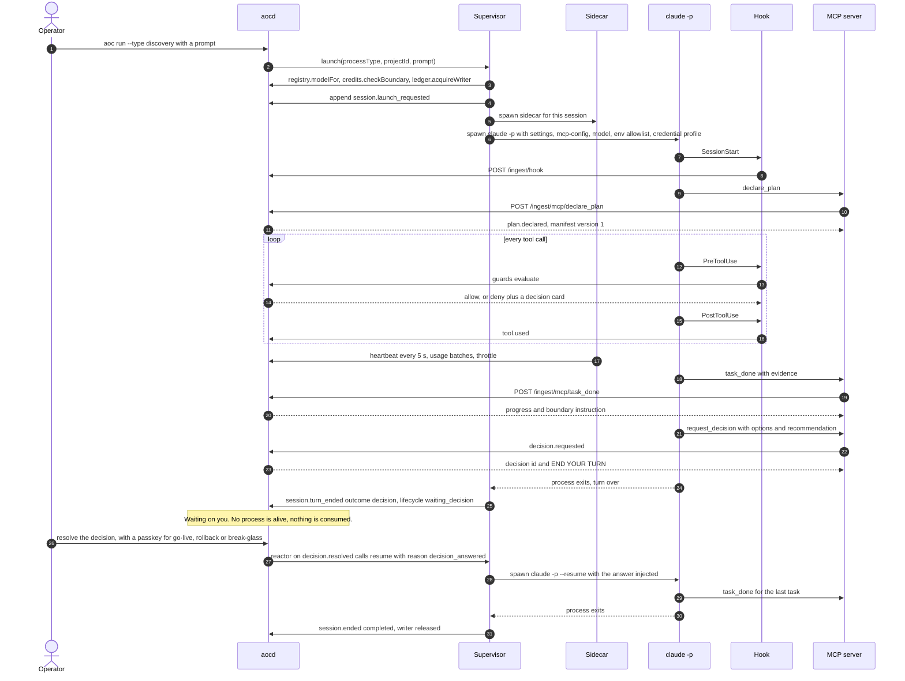

Session lifecycle (independent of liveness; liveness is derived from lifecycle plus live signals):

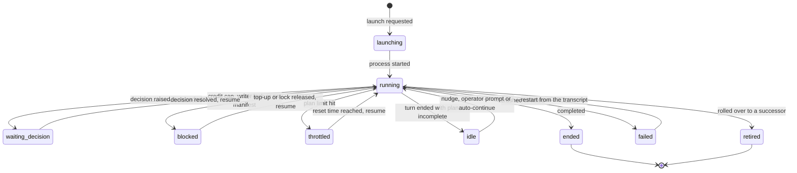

## 5. Event-sourcing model

Every state change is an event appended through `EventStore.append()`. Read models are projections of the log.
Nothing writes domain tables except projectors (ADR-0001).

### 5.1 The chain row

Table `events` in `aoc.db` (kernel [`event-store.ts`](../packages/kernel/src/store/event-store.ts)):

| Field | Meaning |
| --- | --- |
| `seq` | 1, 2, 3, … with no gaps; assigned by the store |
| `id` | `evt_<ULID>`: time-sortable |
| `ts` | Store-assigned ISO-8601 time (the writer's clock) |
| `type` | A catalog event type, e.g. `task.done` |
| `actor` (`actor_kind`, `actor_id`) | `human` (`usr_…`), `agent` (an AOC session id `ses_…`) or `system` (a component name such as `supervisor` or `scheduler:fx`) |
| `scope` (+ indexed columns `project_id`, `thread_id`, `session_id`, `task_id`, `ticket_id`, `change_id`, `decision_id`, `user_id`) | Ids only, never text |
| `meta` | Chained **in clear**. Ids, enums, numbers, booleans, hashes and short machine labels only. Each type's meta schema is `strict`, so unknown keys are rejected and free text cannot leak into the clear-text chain |
| `payload_hash` | The **blinded** hash of the body (§5.3), or null for header-only events |
| `body_scope` | The encryption-key scope of the body (§5.4) |
| `source` | `hook`, `mcp`, `sidecar`, `supervisor`, `api`, `scheduler`, `cli`, `intake` or `system` |
| `source_ts` | Time at the source, for buffered or observed events |
| `idempotency_key` | Unique. A repeated key returns the original event, so retries and spool replays are exactly-once |
| `causation_id` | The event that caused this one (reactor follow-ups) |
| `prev_hash`, `hash` | The chain link |

Client-supplied header fields are bounded so that nothing personal or bulky can enter the chain through them:
`sourceTs` must be ISO-8601 (10 to 40 characters), and `idempotencyKey` at most 512 characters with no control
characters. Ingest derives the chained key from a hash of the session and the client's key, so one session's key
can never collide with, and swallow, another session's event.

`hash = SHA-256(canonicalJSON({v: 1, chainId, seq, id, ts, type, actor, scope, meta, payloadHash, bodyScope,
source, sourceTs, idempotencyKey, causationId, prevHash}))`. The first event links to
`SHA-256("aoc-genesis:" + chainId)`, where `chainId` is 16 random bytes created with the database. Canonical
JSON sorts keys and drops `undefined`, so the chain verifies byte for byte on any machine. `BEFORE UPDATE` and
`BEFORE DELETE` triggers make the table append-only to the application.

### 5.2 Writing an event

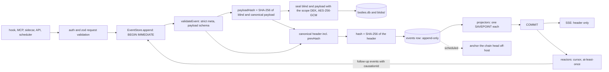

`appendMany()` writes several events in one transaction (all or nothing). If the transaction fails, body rows
written in it are deleted again and the in-memory head is reloaded from the database.

### 5.3 Blinded payload hashes

The chain stores `payloadHash = SHA-256(blind + ":" + canonicalJSON(payload))`. The blind is 16 random bytes,
and it is stored **only inside the encrypted body** (`{b: blind, p: payload}`). An unblinded hash of a short value
(a name, an IC number, a one-word answer) could be brute-forced from the chain alone once the body is gone. The
blind prevents that. `verifyBody()` recomputes the hash whenever the body still exists: `false` means tampered,
`null` means erased or header-only (ADR-0003).

### 5.4 Per-scope encrypted bodies and blobs

Bodies (prompts, tool summaries, decision text, intake descriptions, file names) live in `bodies.db`. Large
binaries (intake video and images) live under `blobs/<scope>/<blobId>`, mode 0600. Scope and blob ids map to
themselves on disk only when they are plain (letters, digits, `_`, `-`, `.`, not starting with a dot); anything
else maps to a SHA-256-derived name. A crafted id can therefore never escape the blob directory, and two scopes
can never share a directory.

- **Envelope encryption.** A 32-byte **KEK** (master key) wraps one **DEK** per scope and generation
  (`key_id = <scope>#<generation>`), with AES-256-GCM and AAD `aoc-dek:<keyId>`. Bodies are sealed with the DEK
  under AAD `aoc-body:<eventId>` and blobs under `aoc-blob:<blobId>`. The AAD binds every ciphertext to its own
  record, so ciphertexts cannot be swapped between records.
- **Scope choice.** `bodyScope` defaults to the event's `sessionId`, then `ticketId`, then `projectId`, then
  `global`. Writers set it explicitly when the data belongs elsewhere. Intake uses the ticket, so one ticket can be
  erased without touching the session that worked on it. Change control keeps the decision cards it raises (change
  request, rollback, go-live) under the change record they are about, else under the project (break-glass), together
  with what the approver typed on them; the record's own text (drafts, affirmed fields, reasons) stays project-scoped.
  **The scope decides what can be erased on its own.**
  Identity events use a per-person scope, `user:<userId>`, so one person's profile and passkey data can be
  erased alone. Personal data must never land in `global` (see [threat model](security/threat-model.md) item O-7).
- `bodies.db` runs with `secure_delete = ON`. KEK loading and custody are in the
  [key custody runbook](runbooks/key-custody.md).

### 5.5 Crypto-shred

`EventStore.eraseScope(scopeId)`, exposed through `mod-audit`'s erase API with a scope id, a reason and a decision
id (permission `audit.erase`, Approver only). The decision id is optional and is only checked to be a resolved
decision, so the procedure in the [key custody runbook](runbooks/key-custody.md#6-crypto-shred) ties each erasure to
an approved change request (threat model O-28). The erasure:

1. Destroys every wrapped DEK generation of the scope and deletes the scope's body rows, blob rows and blob
   files. It then runs `wal_checkpoint(TRUNCATE)` on `bodies.db`.
2. Calls every projector's `onErase(scopeId)` to scrub free text in read models (they show `[erased]`). Read
   models in `aoc.db` hold **decrypted copies** of some text (ticket descriptions, session titles), so this step
   matters as much as the first. `aoc.db` does not yet use `secure_delete`, so overwritten text can linger in free
   pages and the WAL until they are reused (threat model O-24).
3. Appends `body.erased {scopeId, reason, erasedBy, bodyCount, decisionId}`.

**The chain stays valid**, because only blinded hashes were ever chained. Projectors receive `payload === null`
for erased bodies on every later rebuild and must degrade gracefully. Backups taken before the erasure still hold
the old DEKs, so see the backup retention rule in the [key custody runbook](runbooks/key-custody.md#6-crypto-shred).

### 5.6 Projections, rebuild and degraded-projector isolation

- A projector declares the tables it owns, its DDL, the event types it handles and `apply(ctx, event, payload)`.
  It runs **inside the append transaction**, so read models are always consistent with the log.
- **Back-fill.** Each projector has a fingerprint (a hash of its tables, DDL, handled types and version), kept in
  `projection_state`. At startup, a projector that is new on an existing log, or whose fingerprint changed, is
  dropped and rebuilt from the log before anything reads or appends. So is any projector marked `degraded`. A module
  added in an upgrade therefore starts with complete read models, and a degraded projection heals at the next
  restart. The fingerprint does not cover the `apply` code: a projector whose behaviour changes must bump its
  `version`, or existing rows keep the old semantics (a code-review rule).
- Each projector runs in its **own SAVEPOINT**. If it throws, only its own changes for that event roll back, it is
  marked `degraded` in `projection_health` (with `failed_seq` and `last_error`), and the event still commits.
  **Ingestion is never blocked by a read-model bug.** The console must show degraded projections.
- `rebuildProjections(names?)` drops the named projectors' tables, recreates them and replays the whole log in
  one transaction, decrypting payloads (`null` where erased). On success it clears their health rows. A rebuild
  holds the write lock, so plan it as maintenance (see [operations](runbooks/operations.md#4-rebuilding-projections)).
- Projectors must be deterministic and free of side effects. `ctx.replaying` tells them a rebuild is running, but
  they must behave the same either way.

### 5.7 Reactors: at-least-once, with cursors

- After `COMMIT`, the bus queues each event for every reactor whose `handles` list includes its type. One drain
  loop runs them **sequentially**.
- Each reactor has a cursor (`reactor_cursors`), the highest seq it has processed. On startup, every reactor
  catches up from its cursor. A crash between commit and reaction therefore causes a redelivery, never a loss:
  delivery is **at-least-once**.
- Reactors **must be idempotent**. They check `store.findByCausation(event.id, type)` before appending a follow-up,
  and they set `causationId` on everything they append.
- A reaction gets 3 attempts. If all fail, it is recorded in `reactor_failures` and **the cursor still advances**:
  a poisoned event cannot stall the bus, but the failure is **not retried automatically**. Operators must review
  `reactor_failures` (see [operations](runbooks/operations.md#5-reactor-failures)).
- A newly added reactor starts at the current head and does not process history.

### 5.8 Header-only SSE

The broadcaster sends `event: aoc` with an `EventHeader` (`seq, id, ts, type, actor, scope, meta`), plus `liveness`,
`notification` (filtered by audience role) and `activity` messages. Payloads are **never** streamed. Meta is clear
text by construction, so the stream cannot leak a body. Requester connections receive nothing. Bodies are fetched
through permission-checked reads, which is also where raw media access is logged (`intake.media_accessed`).

### 5.9 Verification and anchoring

`verifyChain()` recomputes every hash and link, and reports gaps and the first bad seq. It also checks that the
indexed scope columns of every row agree with the chained scope, because per-session and per-ticket views filter on
those columns: rewriting them alone would hide events from a view while the hashes still verified.

An in-file chain alone is defeatable by anyone who can write the file: drop the triggers, edit, recompute (R2).
Real verification compares recomputed hashes with **off-host anchors** (`mod-audit`, ADR-0010):

- The job `audit.anchor` runs daily at `audit.anchorAtLocalTime` (02:00). It checks governed config for changes,
  anchors the head (two retries, 30 s apart), then runs Verify. `aoc anchor` and `aoc verify` do the
  same on demand.
- **git provider:** one commit per anchor in a separate repository (`anchors/<date>-<seq>.json` holding
  `{chainId, seq, hash, anchoredAt, previousAnchor}`), pushed to `audit.anchorRemote`. Commits use explicit
  identity and signing settings, so the host's global git config never applies. **rfc3161 provider:** a timestamp
  token from `audit.tsaUrl`, kept with its request under `<dataDir>/anchors`.
- **Verify** lists the off-host records independently (it fetches the remote branch, or reads the TSA artefacts)
  and never trusts `anchor.created` rows alone. It reports: a recomputed hash that differs from an anchor; an
  off-host record that is missing, or that was pushed and later disappeared from the remote; broken links between
  anchors; anchors of a foreign chain id (a replaced log); unsigned commits when signing is configured; and TSA
  times that are more than an hour from the anchor time. It bounds the tampered range (`firstBadSeq`) and counts
  the unanchored tail. The result is chained as `chain.verified`.
- Without `audit.anchorRemote`, Verify warns that the git anchors are not off-host: the default configuration does
  not mitigate R2. See the [anchoring runbook](runbooks/anchoring.md).

## 6. Liveness

Liveness is **derived** from instrumented events, never animated by the UI (§4). The pure function
`deriveLiveness()` in [`liveness.ts`](../packages/contracts/src/liveness.ts) is shared by the server, the
supervisor and the tests. `mod-sessions` evaluates it on every signal and on a 5 s sweep. It **chains only
changes** (`session.liveness_changed {from, to, reason}`); heartbeats stay in memory (at a 5 s interval, chaining
them would add about 17,000 rows per session per day, §13).

**Precedence: Waiting on you > Throttled > Dead > Stalled > Thinking > Working.** The first matching row wins.

| # | State | Derived when | `reason` labels |
| --- | --- | --- | --- |
| — | (no badge) | Lifecycle `ended` or `retired` | `ended`, `retired` |
| 1 | **Waiting on you** | An open decision on the session, or lifecycle `waiting_decision`, `blocked` (credit cap, writer lock, no manifest, awaiting top-up) or `idle` (turn ended with the plan incomplete) | `open_decision`, `blocked`, `turn_ended` |
| 2 | **Throttled** | Lifecycle `throttled`, or a plan-limit reset time still in the future (the badge shows the reset time) | `plan_limit` |
| 3 | **Dead** | Lifecycle `failed`; the sidecar reports the process exited; no heartbeat for more than `deadAfterMs` (45 s); or no heartbeat ever, while running, after twice that | `process_failed`, `process_exited`, `no_heartbeat`, `never_reported` |
| 4 | **Stalled** | One tool in flight longer than `toolStallAfterMs` (20 min), or no tool or model activity for `stallAfterMs` (10 min — CEO decision 2026-10-09; can be overridden per process type) | `tool_hung`, `no_activity` |
| 5 | **Thinking** | Alive, with no tool in the last `workingWindowMs` (30 s), while model output streams or the session is starting | `streaming`, `starting` |
| 6 | **Working** | A tool in flight (below the hung threshold), or a tool finished within the last 30 s | `tool_in_flight`, `recent_tool` |

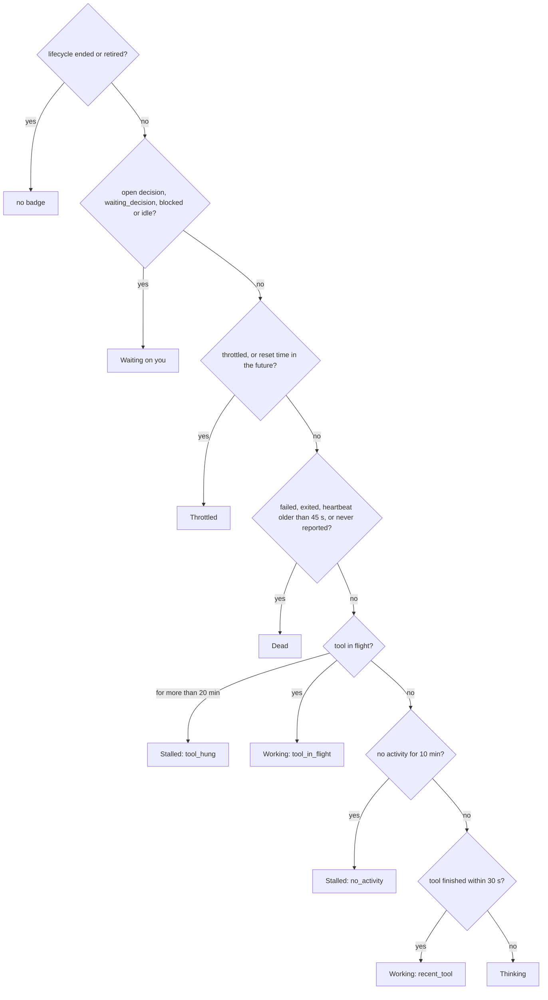

Signals and their sources:

| Signal | Source | Trust |
| --- | --- | --- |
| Process alive or exited | The supervisor (parent of `claude`) and the sidecar (`kill(pid, 0)`) | Supervisor: authoritative. Sidecar: see the threat model |
| Heartbeat | Sidecar, every 5 s, with the session's sidecar token (never in the `claude` env, G-44) | Observational; out of the model's reach with session isolation (threat model T-4) |
| Tool in flight or finished | `PreToolUse` / `PostToolUse` / `PostToolUseFailure` hooks | Agent-reachable token |
| Model output | stream-json deltas seen by the supervisor; transcript growth seen by the sidecar | Supervisor: authoritative |
| Throttle | `rate_limit_event` (status `rejected`, `resetsAt`), the `StopFailure` hook with `error: rate_limit`, `result.api_error_status: 429`, then the text fallback | Supervisor stream first |

Observed sessions have no sidecar. Any hook event counts as activity, and they are **never declared Dead by
silence** (`deadAfterMs = ∞`), because an idle terminal is not a dead process.

UI rules (§12): liveness is always a badge (colour, icon and a word), never a chart. Thinking is neutral, not amber.
As approved with the mock on 2026-10-09, badges are solid for the four states that need a human (Waiting on you,
Throttled, Dead, Stalled) and soft for Working and Thinking, and console tiles are ordered by liveness precedence.
The heartbeat drives a static "alive" indicator that pulses only on activity, never as a steady pulse that a
stalled session would also show.

## 7. Progress

Progress is **measured**, not estimated (§4, §9): weighted tasks done over tasks declared, from the plan manifest.
The pure function `computeProgress()` in [`progress.ts`](../packages/contracts/src/progress.ts) is used by the ledger,
the UI and the tests.

| Size | `xs` | `s` | `m` | `l` | `xl` |
| --- | --- | --- | --- | --- | --- |
| Weight | 1 | 2 | 3 | 5 | 8 |

- **Live tasks** are tasks not `removed`. `pct = round(1000 × doneWeight / totalWeight) / 10`, which is 0 when
  nothing is declared. Phases are computed the same way. A phase is complete when every live task in it is done,
  and completion pins an immutable git tag or SHA (`phase.completed`, §8).
- **ETA** is hidden until at least **3** tasks are done (`etaHiddenReason: fewer_than_3_done`), and hidden again
  when everything is done (`complete`). Otherwise `etaMs = elapsed / doneWeight × (totalWeight − doneWeight)`.
  Example: tasks `m`, `s` and `xs` done and one `xl` open gives done weight 6 of 14 = **42.9 %**. After 2 h elapsed,
  the ETA is 2 h / 6 × 8 = **2 h 40 min**.
- **Evidence rule.** Every `task_done` carries evidence (a test id, a commit SHA or a diff ref). The ledger
  verifies it and sets `flag`: `no_file_change` when the working tree and commits did not change since the
  previous close, and `evidence_unverified` when the ref cannot be confirmed. Flagged tasks still count until they are
  reviewed (CEO decision with the mock, 2026-10-09), and the flagged count is shown next to the percentage. The "file changed" fact must come from git (working-tree
  fingerprint or commits), not from tool names (§4; Bash changes files too).
- **The ledger never holds aocd's thread for git.** aocd is the sole writer, and every managed session's PreToolUse
  hook has about 2.5 s and fails closed, so each git call of `declare_plan`, `amend_plan` and `task_done` is async with its
  own timeout (`gitTimeoutMs`, default 4 s) and the event is appended only after git has answered, from the state at
  that moment. A check that times out is unknown, not refuted: the task is recorded with `evidenceVerified: false`,
  `flag: evidence_unverified` and `evidenceReason: git_timeout` (a plan declared on a slow repository records
  `baselineReason: git_timeout`, and commit evidence is then unknown too), never as verified.
  How git starts is the kernel's rule (G-04): safety settings on every call, and, when aocd is root and a session
  user owns the working copy (session isolation), git runs as that owner, so the ledger reads session repositories
  without ever setting `safe.directory`. The two plumbing reads on the evidence path, HEAD and "is this commit new?"
  (one `rev-list`), also drop system and user config, lazy fetch and every transport by environment.
- **No manifest, no work.** A process type with `requiresPlan` is blocked from file-changing tools until
  `declare_plan` (`session.blocked {reason: no_manifest}`).
- **Amendments** (`plan.amended`) record `prevTotalWeight` and `newTotalWeight` under the amending developer's
  name, so the denominator changes visibly and scope creep is never silent (§9).
- **Master timeline.** Project progress spans every session's manifest from every developer. It is drawn as a
  stacked per-phase segment bar with one segment per contributor (`ProjectTimeline`). Its honesty depends on the
  evidence rule (R9).

## 8. Decisions: one engine

Every human-required decision, from an agent's ambiguity question to break-glass, goes through one engine
(`DecisionService`, `mod-decisions`; ADR-0009). There is one inbox, one aging rule, one audit trail and one
resolution path.

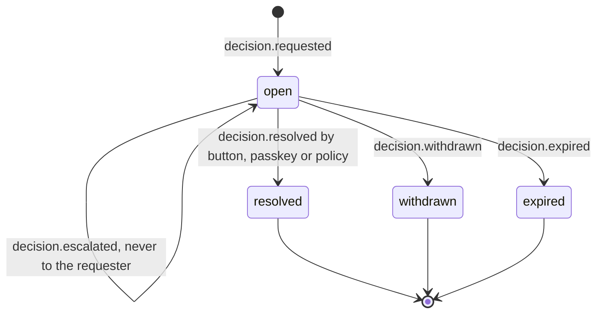

Routing comes from `requiredRoleFor()` and `requiresPasskey()` in
[`decisions.ts`](../packages/contracts/src/decisions.ts). An Approver can resolve anything a Builder can, except
the Requester-only UAT sign-off.

| Kind | Raised by | Minimum role | Passkey | Separation of duties and eligibility |
| --- | --- | --- | --- | --- |
| `agent_decision`, test `main` (1), `production` (2), `data` (5) | Agent, `request_decision` | Approver | — | The session owner (requester) is excluded. These tests are also enforced at the tool boundary |
| `agent_decision`, test `irreversible` (3), `ambiguity` (4) | Agent | Builder | — | Owner excluded. These tests are self-reported (§2.4) |
| `protected_operation`, test `main` (1), `production` (2) or `data` (5) | The `protected-op` guard (`mod-change`), for a blocked attempt | Approver | — | The session owner (requester) is excluded. Earlier logs recorded these cards as `agent_decision`; both kinds resolve the same way |
| `fix_plan` | Intake, after triage | Approver | — | Nothing touches code before it clears |
| `go_live` | Promotion, after the provenance check | Approver | **Yes** | Requester excluded |
| `rollback` | Change control, after a clean verification | Approver | **Yes** | Requester excluded |
| `break_glass` | Emergency promotion | Approver | **Yes** | Invoker excluded. The most audited event in the system |
| `change_request`, scope `reversible_off_main` | Developer (AI-drafted) | Builder | — | **Self-approval allowed** in change control (`change.approved {selfApproved: true}`, no card needed). It is still a full change record |
| `change_request`, scope `main`, `production` or `data` | Developer | Approver | — | Requester excluded |
| `playbook_approval`, `lesson_binding`, `fx_discrepancy` | Registry, learning, FX | Approver | — | — |
| `credit_topup` | Button-raised by the capped developer | Approver | — | **Never the requester.** The first cap hit in a period is auto-granted by policy (method `policy`) |
| `triage_reconciliation`, `low_confidence_diagnosis` | Intake | Builder | — | R17: disagreement goes to a human |
| `uat_signoff` | Intake | Requester | — | Eligible: the ticket's own requester only |

- **Separation of duties.** `requesterId` is always added to `excludedApproverIds`, except for UAT sign-off. For a
  card raised by an agent, the requester is the session owner. The engine never lets a requester resolve their own
  card (`canResolve` → `separation_of_duties`), and it refuses to create a card whose eligible users are all
  excluded (`no_eligible_resolver`). Escalations (`decision.escalated`) go to the Approver role, never back to the
  requester (§6).
- **A single Approver** (CEO decision, 2026-10-09). The sole-Approver fallback is **off**
  (`decisions.soleApproverFallback: false`). With one Approver, an Approver-level card raised from the Approver's
  own session waits until a second Approver exists; separation of duties is not relaxed. If the flag is
  turned on, the only active Approver may resolve their own request, recorded `selfApproved`, but never a credit
  top-up, and the fallback stops applying as soon as a second Approver is active. The switch itself is not chained
  yet: `decisions` is not among the governed settings behind `config.changed` (threat model O-8).
- **Policy resolution** is allowed for exactly one kind: the `credit_topup` auto-grant, once per requester per
  period. Every other kind needs a human.
- **Expiry.** The catalog has a dedicated `decision.expired {decisionId, ageMs}` event. At this commit,
  `mod-decisions` still records expiry as `decision.withdrawn {reason: expired}`, and should move to the dedicated
  event (gap G-33).
- **Decision SLAs** (approved with the static mock on 2026-10-09): rollback 30 min, agent decision 1 h, credit
  top-up 1 h, go-live 2 h, fix plan 4 h, lesson binding 2 days. They drive breaches and the gate-latency KPI in
  the Control Tower. A protected operation keeps the agent decision's 1 h: it was one until it got its own kind.
- **Passkeys.** For `go_live`, `rollback` and `break_glass`, the WebAuthn challenge is bound to
  `(decisionId, optionId, user)`, and `decision.resolved` records `passkeyVerified`. Elsewhere in v1 a bearer
  token or cookie proves **which token**, not who. That is attribution, not a signature (§6).
- **Ending the turn.** An agent that raises a decision is told to end its turn. The decision then waits at zero
  cost and survives reboots. On resolution, a reactor calls `supervisor.resume(…, 'decision_answered')` with the
  answer injected (§2.3, ADR-0006).
- **Aging (R15).** Every card shows its age. Reminders fire after `decisions.remindAfterMinutes` (30), with an
  in-page notification, a tab badge and an opt-in webhook. `ageMs` is chained on resolution.

## 9. Credits at task boundaries

Credits are **behaviour control**: a hard cap, but one that never terminates a session mid-task (§10, R7,
ADR-0007). `CreditService.checkBoundary()` is called **only** at the launch boundary and on `task_done`. Its answer
travels back to the agent as the `boundary` field of the `task_done` reply.

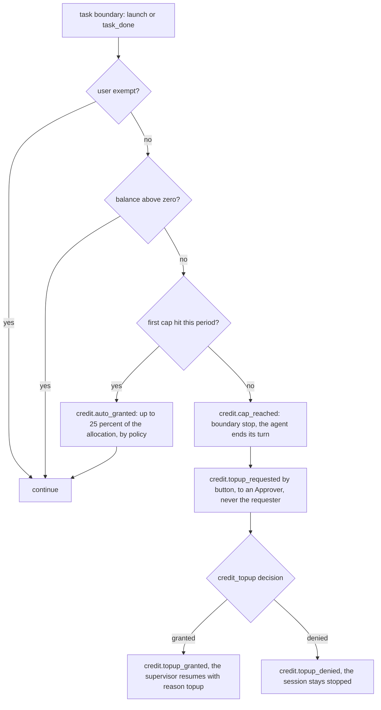

- Balance = allocation (default USD 300 notional per month, `credits.defaultMonthlyAllocationUsd`) + grants −
  used. "Used" is the notional cost from metering. The period is the local calendar month.
- The auto-grant happens once per period, is worth at most `autoGrantPct` (25 %) of the original allocation, and
  is recorded as a policy-resolved decision. There is no compounding and no AI repeat grant.
- Every grant and top-up records who, how much, against which task, and the balance before and after.
- A waiting top-up shows as its own aging state ("Waiting on you: awaiting top-up"), not as a stall.
- **Credits never pick the model.** `routeModel()` ignores budget, and the discovery-runs-on-Opus rule overrides
  it (R8).

## 10. Metering, kept separate from credits

| | Metering | Credits |
| --- | --- | --- |
| Purpose | Internal decision support: the Enterprise-migration case and throttle-loss analysis (§10) | Behaviour control: a spending cap per person per period |
| Gates anything? | **Never.** Read-only; it observes | Yes, but only at task boundaries |
| Inputs | `usage.recorded` (per message, deduplicated), `throttle.hit` and `throttle.cleared` (`idleMs`), the rate card, FX, the subscription | Metering's notional USD per user, allocations, grants |
| Output | Notional API-equivalent cost, **labelled as notional** (no per-token bill on a Max plan). Daily `rollup.closed` in USD and RM. RM totals are the sum of the daily rollups, each at its own day's BNM rate, never the total times today's rate. Subscription cost shown separately | `BoundaryInstruction`, `credit.*` events |
| Changes | Rate-card versions apply **forward only**. Closed days are never restated (R12) | Allocations and top-ups are audited events |
| Picks the model? | No | No |

Metering facts that the sidecar and metering module rely on (research note §6.3): count each assistant `message.id`
once; tail subagent transcripts too (their usage is not in the main file); price 5-minute and 1-hour cache writes
separately; never sum `total_cost_usd` across `--resume` invocations, because it is cumulative per session.
The same cumulative behaviour is what lets the supervisor check each turn's sidecar totals against `modelUsage`
(§2.3). Throttle idle time is metered too, because the enterprise case is productivity lost to throttling, not only
dollars.

## 11. FX state machine

The daily USD/MYR rate for each local date `D` (§10, R13). Implemented by `mod-fx` (Built). Its sources and
defaults follow the [BNM research note](research/bnm-fx.md) (gap G-36).

**Definition.** AOC's rate for `D` is BNM's Kuala Lumpur interbank *middle* rate for the configured session
(`fx.session`, default `1700`, the end-of-day reference), in ringgit per 1 USD. Every `fx.rate_recorded` and
`fx.discrepancy_raised` carries the session in `meta.session` (a carried-forward rate keeps its source's session).
Session 1130, the best counter rates of selected banks, has no middle rate and is never used.

**Schedule.** BNM publishes a session about 40 minutes after its time (1700 at about 17:40 MYT). The job `fx.daily`
runs at `fx.runAtLocalTime` (default 18:00 MYT), and a job `fx.retry@HH:MM` runs at each of `fx.retryAtLocalTimes`
(default 18:30 and 21:00). A retry re-attempts the day only while nothing is recorded for it (not yet published, or
not yet confirmed by the API) or its page was unreadable. A failed Sonnet escalation stops for the day; the Approver
can still re-run it with `POST /api/fx/run`. The last scheduled attempt decides: a day that is still unpublished then
is a public holiday.

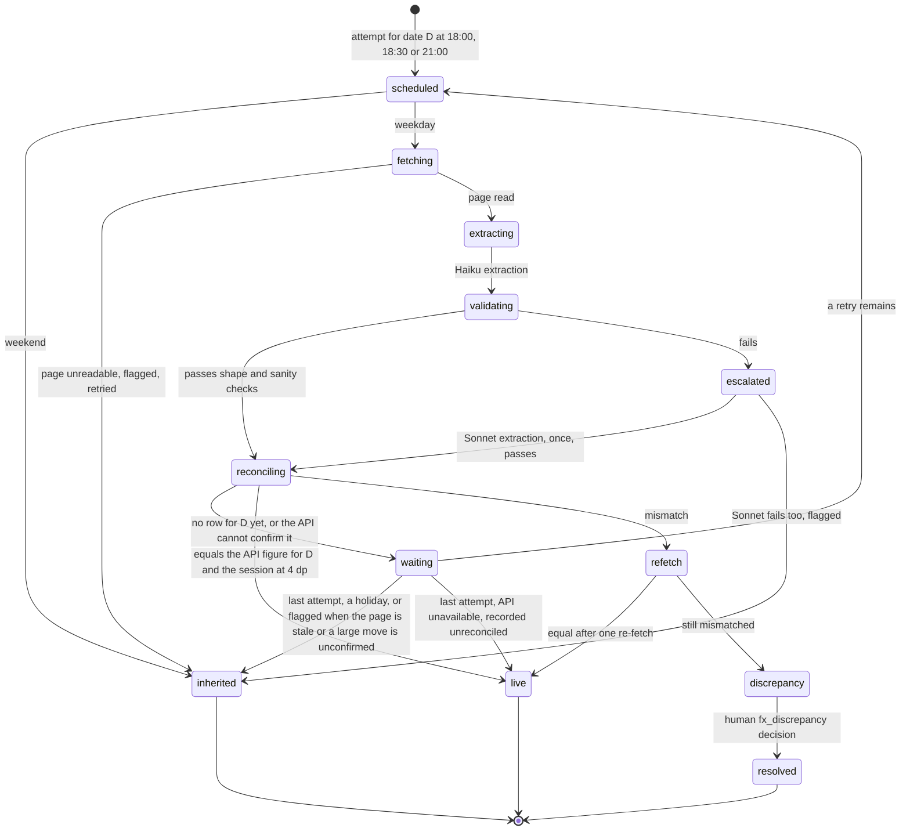

- **Sources.** The page `https://www.bnm.gov.my/exchange-rates` shows session 1700, middle rate, RM per unit, one
  row per publication day; a GET cannot select another session. The BNM Open API is read at
  `<apiUrl>/date/<D>?session=<session>` with `Accept: application/vnd.BNM.API.v1+json`. Its 404 JSON
  (`No records found.`) means "not published". A figure for another date or session, a null middle rate, or a
  non-JSON answer means "can't read".
- **Live**: `fx.rate_recorded {status: live, extractor: haiku | sonnet, validation: pass, reason: fetched, session}`.
- **Inherited**: carry forward the last rate, stamped with its `sourceDate`, its session and a reason:
  `weekend_or_holiday`, `source_unreadable` or `validation_failed`. Weekend and holiday gaps carry forward by
  design and are not flagged.
- **Reconciliation** compares both figures rounded to 4 dp. They may differ by `fx.reconcileTolerance` (default
  0.0001, one unit in the fourth decimal). "Can't read the source" means carry forward with no ticket. "Read but
  mismatched against the true BNM figure" means re-fetch once, and if it is still unreconciled, raise
  `fx.discrepancy_raised` as an audited Approver decision that carries both figures. The day carries forward
  (`discrepancy_pending`) until a human resolves it (`fx.discrepancy_resolved`, recorded as `manual_override`).
- **Sanity bounds** reject out-of-band values (default 3.5 to 5.5) and day-over-day moves above
  `fx.sanity.maxDailyChangePct` (3 %). A move above `fx.sanity.softFlagPct` (1.25 %, about the 2025–26 p99) is
  accepted only when the API agrees exactly at 4 dp. A different API figure is a discrepancy. No API figure by the
  last attempt means carry forward (`validation_failed`, problem `soft_flag_unconfirmed`) and an `fx.alert` asking
  for a manual check.
- **Alert.** After `fx.carryForwardAlertWeekdays` (default 3) weekdays in a row without a live rate,
  `fx.carry_forward_alert` asks for a manual check, once per streak. Weekends never count. Holidays and weekdays
  without any record do; BNM's longest holiday run in 2025–26 was two weekdays.
- **Re-check of the previous weekday** (`fx.recheckPreviousWeekday`, default on). The first run of a day looks at
  the previous weekday once. If it was stamped a holiday or its page was unreadable, and the API now has that day,
  the day is attempted again. Metering closes each day at 00:15, though, and a closed day is never restated, so
  with the default schedule a late figure is usually only reported (`fx.alert`, info). A failed extraction is not
  re-checked.
- **Stamped downstream.** `FxService.rateFor` returns the session with the rate, and `rollup.closed` records it as
  `fxSession` (optional, so older rollups stay valid).
- **Session 0900 or 1200.** If the noon rate is mandated, set `fx.session: "1200"`, `fx.runAtLocalTime: "13:00"` and
  `fx.retryAtLocalTimes: ["13:30", "15:00"]`. The page cannot show 1200 without a form POST, so the rate is the API
  figure alone (`extractor: api`): sanity-bounded, but with no page cross-check and no LLM.
- Rates and rate-card changes apply forward only. A closed `rollup.closed` keeps the rate it was stamped with.

## 12. Error learning and repeat-offence detection

A distilled lessons registry, not a raw error log (§11). Implemented by `mod-learning` (Built).

- **Occurrences.** `error.observed` comes from tools, tests, UAT, rollbacks, hooks, agent reports
  (`report_error`) and CI. It carries a signature, code area, process type, model and cost. Transient errors are
  logged and forgotten.
- **Root-cause classes** (`rootcause.class_defined`) cluster occurrences **by cause, not by error text**, in one
  dimension: `spec`, `context`, `tooling`, `codebase`, `guardrail`, `model_capability`, `environment` or
  `unknown`. The root cause often points outward (an ambiguous spec, a missing guardrail); the agent is frequently
  the symptom.
- **Model as a tested dimension.** A class is `model_capability` only when it recurs on the cheaper model and not on
  the stronger one. The fix is then a targeted per-process-type upgrade, not a blanket one.
- **Priority** is the cost of recurrence, not the count. UAT failures enter with `priority: high`.

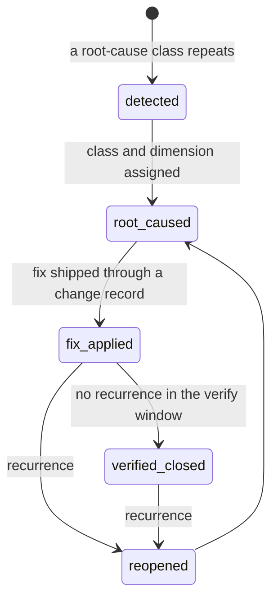

Lessons are where learning reaches the fleet, so they are gated:

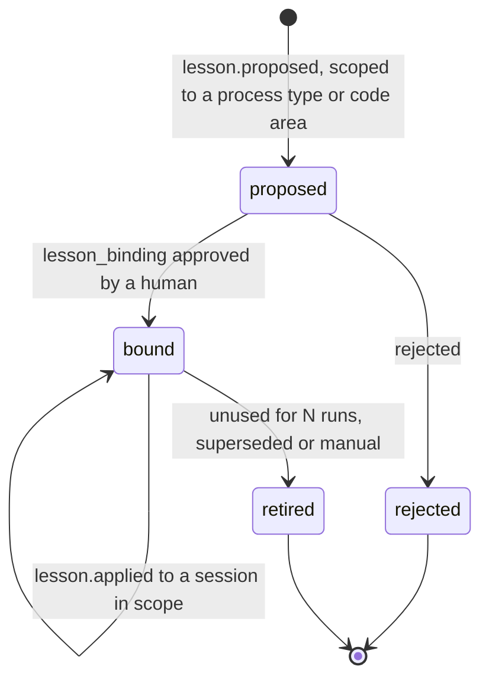

- A lesson becomes binding only through a human decision, because one bad lesson corrupts the fleet.
- Lessons are scoped, never global. They retire after `learning.retireAfterUnusedRuns` (20) unused runs (R10).
  Each one tracks repeats prevented and tokens or time saved.
- Verified closure needs no recurrence for `learning.verifyWindowDays` (14).
- **No per-person blame.** Occurrences and classes carry no user id. Read models aggregate by class, process type,
  code area and model, never by person (R11). See the threat model for the residual (a session id can be joined to
  its owner).

## 13. Change control, rollback, break-glass and provenance

### 13.1 Change requests

Every post-MVP change is a change request: a first-class decision that cannot start until four fields are
supplied and approved. The fields are **impact analysis**, **mitigation plan**, **rollback plan** (naming the
exact commit or tag to return to) and **acceptance test** (§8).

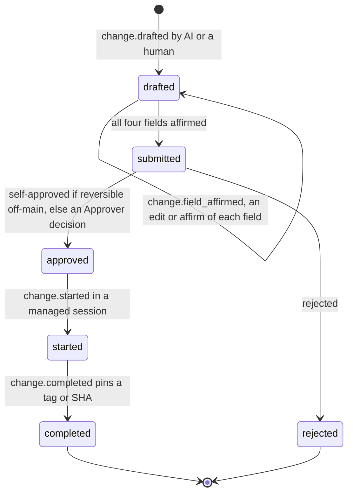

"Invisible governance with accountability" (§14): AI drafts the fields, and the developer must edit or affirm each
one. `change.field_affirmed` records `edited`, `editRatio` and `dwellMs`, so a blind one-click confirm is flagged
and a per-developer affirm-without-edit rate is tracked. Self-approved reversible off-main work still produces a
full change record under the developer's name.

### 13.2 Rollback, break-glass and promotion

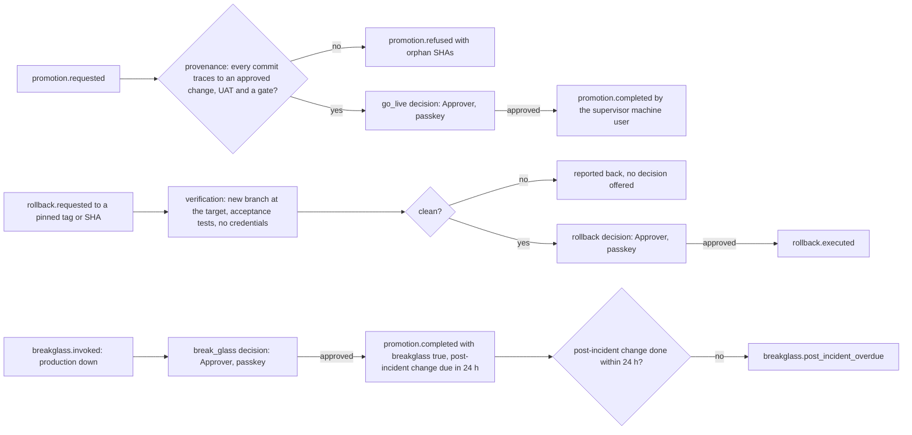

- **Rollback is real.** Every phase completion and change record pins an immutable git tag or SHA
  (`git.ref_pinned`). Rollback is a human-required, audited decision. The dashboard issues it; the supervisor checks
  the tag out on a new branch, runs that state's acceptance tests (`rollback-verify` process type, no credentials),
  and reports back before anything touches main. The Approver approves only a clean result, with a passkey. There is
  no one-tap rollback from a phone onto the main line. Execution preserves history: the target state is committed
  on top of main as a fast-forward, nothing is force-pushed, and `rollback.failed` records a rollback that could not
  be applied (main is then left unchanged).
- **Break-glass** is permitted when production is down. It is the most heavily audited event, routes straight to the
  Approver, and auto-raises a mandatory post-incident change record due within 24 hours
  ([runbook](runbooks/incident-break-glass.md)).
- **Provenance guarantee** (§14). `ChangeService.provenance(projectId, sha)` checks that every commit between main
  and the candidate traces through an approved change record, a UAT sign-off and a gate. Otherwise the promotion is
  refused (`promotion.refused {reason, orphanShas}`). Break-glass is the sole exception, and it is marked as such.
  Today a commit is "traced" by its `AOC-Session` or `AOC-Change` message trailer, which the system prompt asks
  managed agents to add (the `prepare-commit-msg` hook is not installed in managed workspaces yet, gap G-37).
  Trailers are plain text that anyone can copy, so they must be cross-checked against commits AOC itself
  recorded (threat model T-22, gap G-25).
- Only the supervisor's machine identity can move `main` and `release/*`. That is enforced by GitHub, not by AOC
  ([credential isolation runbook](runbooks/credential-isolation.md)).

## 14. Project thread and context rollover

- **One active writer per thread** (`thread.writer_acquired` / `thread.writer_released`). Rollover is sequential;
  there are never parallel writers on the same code. Parallel agents are allowed only for read-only bug triage
  (§5, §7).
- **When.** Context use is compared with the model's context window times the type's `rolloverContextPct`
  (default 70 %, 85 % for `migration`). Rollover happens **only at a clean task boundary**: past the threshold,
  `task_done` returns `{continue: false, reason: rollover}`, the agent ends its turn, and when the turn ends the
  supervisor rolls the thread over if `LedgerService.boundaryState()` reports no half-done task and no risky
  playbook step. Read-only sessions never roll over. Risky types never roll over on their own (R16): the supervisor
  notifies a human, who rolls over by hand at a clean boundary, and a manual rollover checks the same conditions.
- **How** (ADR-0008). `buildHandoffBrief()` deterministically distils manifest status, key decisions with their
  reasons, open decisions and file pointers. The code is the source of truth, not the transcript. Then
  `validateBrief()` checks the brief against the manifest and open decisions, and the supervisor appends
  `session.rollover_started {briefHash}`, launches the successor with the brief as its opening context, retires the
  old session, and appends `session.rollover_completed`. Any problem appends `session.rollover_aborted {problems}`,
  and the old session keeps the thread.

## 15. Identity model

Identity is done properly before any non-CEO surface ships (§6, §15.3). Implemented by `mod-identity` (Built).

| Principal | Id | Authenticates with | Notes |
| --- | --- | --- | --- |
| Person | `usr_…` | A bearer user token (`aoc_u_…`), or a console cookie session (`aoc_session`, a `web_session` token opened from a user token; TTL `identity.sessionTtlHours`, 12 h) | Role `approver`, `builder` or `requester`, plus the flag `complianceLead`. Only a token's SHA-256 and a short non-secret prefix are stored (`token.issued`). Cookies are `HttpOnly` and `SameSite=Strict`, `Secure` when `publicUrl` is HTTPS, and cookie-authenticated writes must come from AOC's own origin |
| First Approver | — | A one-time bootstrap token from `AOC_BOOTSTRAP_TOKEN`, or generated into `identity.bootstrapTokenFile` (default `<dataDir>/bootstrap-token`, mode 0600; the path is logged, never the token) | Bootstrapping runs only while no user exists. Log in, create a personal token and a passkey, then revoke the bootstrap token and delete the file |
| Passkey | credential id hash | A WebAuthn assertion over a challenge that is the SHA-256 of a binding: user, decision, option, a hash of the card as shown, a nonce and an expiry | Required for `go_live`, `rollback` and `break_glass`. `passkey.asserted` keeps the signed assertion and its binding, so the approval can be re-verified independently later. The signature counter is tracked |
| Managed session | `ses_…` (actor kind `agent`) | A per-session ingest token (`aoc_i_…`) | Issued at launch and revoked when the session ends. **Visible to the model** (it is in the claude environment), so it is scoped to its own session and is append-only (threat model T-3) |
| Session sidecar | `ses_…` (actor kind `agent`) | A per-session sidecar token (`aoc_c_…`) | Issued by the supervisor and passed only in the sidecar's environment, never the `claude` one; revoked once the session's last sidecar has exited. Valid for the five sidecar report routes of its own session and nothing else (threat model T-4) |
| Observer | — | An observer ingest token (`aoc_o_…`), issued by the Approver with a label and an expiry | Observed events only. It can never post managed events or block |
| System component | name (`supervisor`, `scheduler:fx`) | A system token (`aoc_s_…`) or in-process | Reactors and jobs act as `system` actors |

Identity data (names, emails, labels, passkey material) is stored in encrypted payloads under the per-person scope
`user:<userId>`, so erasing that scope crypto-shreds one person's identity data while the chain stays valid.

Permissions per role are in [`roles.ts`](../packages/contracts/src/roles.ts). In short:

- **Approver**: every permission except the Requester's own UAT sign-off and the compliance stamp.
- **Builder**: view all sessions and the full audit trail; launch and drive their own sessions; create change
  records and self-approve reversible ones; request top-ups, rollbacks, promotions and break-glass; curate
  learning; generate evidence; view internal tickets.
- **Requester**: submit an intake, view their own tickets, sign off their own UAT.
- `mapping.stamp` is granted only by the `complianceLead` flag (to an Approver or a Builder), never by a role (R3).
- Raw intake media stays behind the role boundary. Builders see it only while one of their own active sessions
  works on that ticket, and every access is logged (`intake.media_accessed`).

## 16. Security architecture in one page

The details are in the [threat model](security/threat-model.md). The load-bearing ideas:

1. **Credential isolation is the wall (§3, R1).** Deploy credentials and protected-branch rights exist only in
   supervisor-controlled session environments, only for process types that need them, and never on developer
   machines or in read-only sessions. GitHub branch protection enforces it server-side. Hooks, guards and
   pre-push hooks are speed bumps that turn attempts into decision cards.
2. **The agent can read everything in its own environment.** Hooks, the MCP server and the model's own Bash all
   inherit the `claude` process environment (research §8). Anything placed there, including the ingest token, is
   reachable by the model, and events relayed from hooks are **agent-asserted claims**. Gates rely on facts the
   agent cannot forge: git state checked by AOC, supervisor-observed process and stream state, and human decisions.
3. **Run agents as a separate, unprivileged OS user, with their own `HOME`.** aocd's files (the KEK, `aoc.db`,
   credential profiles) are protected by file permissions, and file permissions protect nothing from a process
   running as the same user. Today sessions run as aocd's user and inherit its `HOME` (threat model O-1).
4. **Untrusted input is data.** Intake text and media, transcripts and tool output are fenced, escaped and never
   executed as instructions. Triage runs read-only (`--tools Read,Glob,Grep`, no credentials, `read-only` guard
   as defence in depth).
5. **Integrity is anchored off-host** (R2), and **keys have a custodian** (R6).

## 17. Self-modification boundary

The platform may build its own features, but never its own governance, audit or credit core (§13). The
`self-modification` PreToolUse guard (`mod-audit`) blocks AOC-managed agents from changing the protected paths of
AOC's own repository, and from touching AOC's audit state (the data directory, the anchor repository, the KEK file,
the credential profiles and the external log). It analyses Bash commands as well as file tools. Every blocked
attempt is written first to a hash-linked log outside the database, then chained as `selfmod.blocked`. Changes to
the core require human code review. See [docs/compliance/self-modification-boundary.md](compliance/self-modification-boundary.md). **This
repository was AI-built. Its governance core must have a human code review before go-live.**

## 18. ISO/IEC 42001 mapping status

- The 002 mapping table was wrong in at least five rows (§13, R3). The provisional corrected mapping is in
  [docs/compliance/iso42001-annex-a.md](compliance/iso42001-annex-a.md) and `config/iso42001-mapping.json`
  (version `2026.10-draft`, `status: provisional`, `stampedBy: null`). It was compiled from public secondary
  sources, **not** from the purchased standard.
- The five corrections to confirm: event logging is **A.6.2.8**; technical documentation is **A.6.2.7**; roles are
  **A.3.2**; incident communication is **A.8.4**; token and resource use is **A.4** (A.4.2 and A.4.5).
- Until the compliance lead stamps it (`mapping.stamped`), the mapping page must not be cited, and every evidence
  pack is labelled provisional (`evidence_pack.generated {mappingStamped: false}`).
- Open questions for the compliance lead (scope, 6.3 versus 8.1, A.3.3 reporting of concerns, A.5.4 and A.5.5
  impact assessments, retention versus erasure) are listed in section 6 of the mapping note.

## 19. Build sequence (§15)

Each stage needs CEO sign-off. Discovery-class stages run on Opus; work from the UI onward runs on Sonnet. A static
design mock of the three main pages ([`mocks/aoc-mock.html`](../mocks/README.md)) is approved before any UI code;
the CEO approved it on 2026-10-09, with its proposed defaults. The 3D Showcase tab is built last.

| Stage | Delivers | Packages | Sign-off evidence |
| --- | --- | --- | --- |
| **1. Operator console and supervisor engine** (discovery: Opus) | Launcher/supervisor; aocd as sole writer with ingest; MCP server; hooks; sidecar; append-only hash-chained SQLite (WAL) with the off-host anchor; liveness; plan manifest and measured progress; decisions with end-turn and resume; metering; the operator console after mock approval | `kernel`, `daemon`, `supervisor`, `sidecar`, `hooks`, `mcp-server`, `client`, `mod-sessions`, `mod-ledger`, `mod-decisions`, `mod-registry`, `mod-metering`, `mod-audit`, `web` | A managed session end to end on `claude-sim` and on real Claude Code; a decision answered after a daemon restart; Verify passing against an off-host anchor; a tamper drill detected |
| **2. Change control and rollback** (discovery: Opus) | Change requests with four fields; affirm-or-edit tracking; pinned refs; gated rollback with verification; break-glass with a post-incident record; promotion with the provenance guarantee | `mod-change`, `supervisor` (`runIsolated`) | A rollback drill on a pinned tag; a refused orphan-commit promotion; a break-glass drill |
| **3. Identity layer** (before any non-CEO surface) | Per-person users and roles; hashed tokens; cookie sessions; WebAuthn passkeys for go-live, rollback and break-glass; per-session ingest tokens | `mod-identity` | Passkey-signed go-live; revoked token rejected; SoD tests |
| **4. Developer role** on the operator surface | Builder permissions; self-approval of reversible off-main work; developer change records; per-developer affirm-without-edit rate; credits and top-ups | `web`, `cli`, `mod-credits`, `mod-learning` | Builder cannot resolve Approver gates; credit cap enforced only at a boundary |
| **5. End-user intake portal** (last: the heaviest auth and upload risk) | Intake with media limits, scanning and encryption; read-only triage; diagnosis budget; human reconciliation; fix-plan gate; UAT loop; go-live through promotion | `mod-intake`, `web` (portal) | Upload abuse tests; prompt-injection drill; PDPA erasure of a ticket |

FX, evidence packs and the learning registry are not sequenced explicitly in §15. They depend on stage 1 (events,
metering) and stage 2 (change records), and they are enabled once those stages are signed off.

The code base is built in parallel waves against one contract (Wave 0). **Stage order therefore governs
enablement, not coding order.** For example, `mod-intake` is already implemented, but the portal must stay
switched off until the identity stage is signed off (R5; gap list P-10).

## 20. Implementation status and open items (2026-10-09)

Built and tested at integration commit `a1c8a0c`: contracts, kernel, client, `aocd`, the launcher/supervisor, the
CLI, the hook binary and git hooks, the sidecar, the MCP server, `claude-sim`, the LLM adapters, the demo seeder,
and every domain module except `mod-tower`. In progress: `mod-tower` (the Control Tower) and the web UI, which is
built to the static mock the CEO approved on 2026-10-09. **Nothing has been independently reviewed yet** (§17).
Spec coverage is tracked row by row in the [traceability matrix](compliance/traceability.md) and the
[gap list](compliance/gaps.md).

CEO decisions recorded on 2026-10-09:

- The static mock is approved as shown, with the defaults it proposed (`mocks/README.md`): among them the decision
  SLAs (§8), flagged tasks counting until reviewed (§7), RM rollups summed per day (§10), and a credit forecast
  that names developers for capacity planning while the anomaly radar stays portfolio-only (R11).
- The stall threshold is **10 minutes** (`liveness.stallAfterMs: 600000`, §6).
- The sole-Approver fallback is **off** (`decisions.soleApproverFallback: false`, §8).

Open items found while writing this document. Owners and details are in the
[threat model](security/threat-model.md#6-requested-changes-and-open-decisions):

1. Agents can get code execution as a privileged user through git configuration and hooks in their own workspace,
   whenever aocd or the supervisor runs git or repository code there (threat model T-2). Today the ledger
   fingerprints workspaces with aocd's own git and `runIsolated` runs as aocd's OS user. (Promotion no longer runs
   the repository's `pre-push` hook with the promotion credential: since G-04 it pushes from a service-owned clone
   with hooks off, and no environment variable unlocks a push to a protected ref.) Privileged git must never run
   in an agent-writable repository.
2. Agents and aocd must run as different OS users, and sessions must not inherit aocd's `HOME`. Otherwise every
   0600 file of aocd, and the service user's `~/.ssh`, git credentials and `~/.claude`, are reachable from every
   agent.
3. The provenance gate trusts commit-message trailers, which anyone can copy (threat model T-22, gap G-25). Until it
   checks AOC's own records of session commits, it proves only what the commit messages claim.
4. With a single Approver, Approver-level decisions raised from the Approver's own sessions **wait for a second
   Approver**, including a break-glass the Approver invokes. That is the CEO's decision (the fallback is off), so the
   remaining action is to appoint a second Approver, or to have Builders invoke break-glass.
5. The `self-modification` guard is built and always protects AOC's audit state, but it protects the core code only
   once `selfModification.aocRepoPaths` is set (the default is empty). The default `protectedPaths` list now covers
   all of Tier 1 (see the [self-modification boundary](compliance/self-modification-boundary.md)).
6. Default anchoring (`anchorProvider: git` with no `anchorRemote`) is local only and does not mitigate R2 until a
   remote is configured, and it runs nightly only (gap G-40). Anchor-commit signing and TSA certificate checks
   are module options that the aocd configuration does not expose yet. Evidence packs compare anchors with the
   chain's own `anchor.created` events, not with the off-host records, so a pack cannot detect a full-chain
   forgery; `aoc verify` can (threat model O-29, gap G-42).
7. FX now follows the BNM research (§11, gap G-36): the 1700 middle rate from 18:00 MYT. The CEO has yet to
   confirm the 1700 (end of day) rate over the 1200 (noon) rate (P-19).
8. The supervisor does not install the `pre-push` and `prepare-commit-msg` hooks in managed workspaces (gap
   G-37), and guard denials that raise a card answer `deny`, so ending the turn still depends on the agent (gap
   G-48, ADR-0006).

## Glossary

| Term | Meaning |
| --- | --- |
| Turn | One `claude -p` process run. A session is a chain of turns joined by `--resume` |
| Session | One Claude Code conversation (one `claudeSessionId`) under an AOC session id `ses_…` |
| Thread | The durable line of work in a project. It spans many sessions through rollover |
| Manifest | The declared plan: phases and sized tasks. It is the denominator of progress |
| Boundary | The moment between tasks (`task_done`, launch) when credits, rollover and stop requests are enforced |
| Scope (body) | The encryption-key scope of a body. Erasing a scope crypto-shreds all its bodies |
| KEK / DEK | Key-encryption key (master key) / data-encryption key (per scope and generation) |
| Card | A decision as shown in the inbox (`DecisionCard`) |
