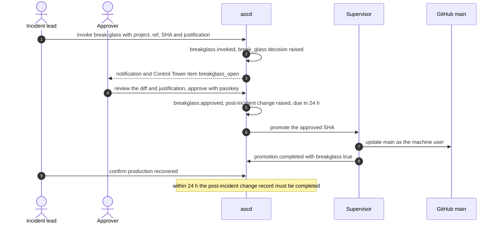

# Runbook: incidents and break-glass

- **Covers:** emergency promotion when production is down (break-glass, §8), the mandatory post-incident record,
  and the response to AOC's own security incidents.
- **Owners:** the incident lead (whoever declares the incident) and the Approver (the CEO).
- **Principle:** "A controlled exception beats a rule bypassed in a crisis" (§8). Break-glass is permitted, and it
  is the most heavily audited event in the system.

## 1. Severity

| Sev | Examples | Response |
| --- | --- | --- |
| **Sev-1** | Production down; Verify fails (a broken chain); a push to `main` with no matching promotion (an R1 breach); a protected credential leaked; KEK compromise; a personal-data breach | Immediately, around the clock. The CEO is informed at once |
| **Sev-2** | A scheduled anchor missed for more than a day; a degraded projection behind a gate view; a reactor failure blocking resumes; an FX discrepancy left unresolved past the day close | Same working day |
| **Sev-3** | A single session failure; an observed spool backlog; a webhook failing | Next working day |

Record every Sev-1 and Sev-2 **outside AOC as well** (the incident channel or tracker). If AOC's own integrity is in
question, its log cannot be the only record.

## 2. When break-glass applies

Use break-glass **only** when all of these are true:

1. Production is down or critically degraded for users.
2. The normal path is too slow for the impact. The normal path is a change request with its four fields, then
   UAT, then the go-live gate with its provenance check.
3. A specific fix is ready: a hotfix commit, or a known-good pinned tag (`aoc/*`) to return to.

Do not use it for deadlines, convenience, or to skip a review that would say no. Every use is reviewed afterwards
(§5).

> **Single-Approver rule.** The invoker of a break-glass can never approve it (separation of duties). The CEO
> decided on 2026-10-09 that a single Approver gets no exception (`decisions.soleApproverFallback: false`). So
> while the CEO is the only Approver, **a Builder invokes and the CEO approves**. A break-glass the CEO invokes
> personally has no eligible approver and waits until a second Approver exists. Keep at least one Builder who can
> invoke reachable out of hours, or appoint a second Approver with a passkey
> ([threat model T-8](../security/threat-model.md#t-8-self-approval-and-separation-of-duties)).

## 3. Break-glass procedure

1. **Declare** a Sev-1 and name the incident lead.
2. **Prepare the fix:**
   - a hotfix through a managed session (the normal discovery or bug-fix types, which keeps credential isolation
     intact), pushed to a branch; **or**
   - the pinned tag of the last known-good state (`git.ref_pinned`). Rolling back to a pinned state through
     break-glass skips the rollback verification step, so prefer the normal
     [rollback](../architecture.md#132-rollback-break-glass-and-promotion) when production can wait for it.
3. **Invoke** from the console or CLI (permission `breakglass.invoke`, held by Builders and the Approver), with:
   - the project;
   - the ref and SHA to promote;
   - a justification: what is down, the user impact, why the normal path is too slow, the fix, and how the result
     will be checked.

   AOC records `breakglass.invoked`. The justification is in the encrypted payload; the ids and SHA are in the
   chain. AOC raises a `break_glass` decision that requires the Approver and a passkey.
4. **The Approver decides** after reading the diff and the justification. Approval needs a WebAuthn passkey bound to
   this decision and option. AOC records `breakglass.approved` with the id of the automatically raised
   **post-incident change record** and its due time (24 h).
5. **Promotion.** The supervisor moves `main` using its machine identity. The provenance check is waived (this is
   the sole exception, §14) and recorded as such: `promotion.completed {breakglass: true}`.
6. **Confirm recovery.** Monitor the product. If the fix did not work, raise another break-glass (each one is
   recorded separately), or roll back.
7. **Communicate** to affected users and other stakeholders (ISO 42001 A.8.4, communication of incidents). AOC
   routes break-glass to the Approver only, so communication to users follows the company's incident communication
   procedure, which this runbook does not replace.

## 4. The post-incident change record (within 24 hours)

The change record raised at approval must be completed within 24 h of approval, under the incident lead's name:

| Field | Content |
| --- | --- |
| Impact analysis | What failed, for whom, for how long, and what the emergency change touched |
| Mitigation plan | What reduces the chance or the blast radius of a repeat |
| Rollback plan | The exact pinned tag or SHA to return to if the emergency change misbehaves |
| Acceptance test | How the emergency change is now verified: tests added, and the UAT done after the fact |

- Each field must be **edited or affirmed** separately. A blind one-click confirm is flagged (§14).
- The record then goes through approval like any change at scope `production`. Whoever submits it cannot approve
  it, so while the CEO is the only Approver, the incident lead (a Builder) submits it and the CEO approves.
- If it is not completed in time, AOC records `breakglass.post_incident_overdue`. The Control Tower shows a
  **critical** `post_incident_overdue` item until it is done.
- The emergency commits must then pass the normal provenance path, so that future promotions are not blocked by
  orphan SHAs. The post-incident change record is what they trace to.

## 5. Post-incident review (within 5 working days)

- **Blameless.** It is about root-cause classes, not people (R11). The agent is often the symptom: look at the
  spec, the context, the tooling and the guardrails.
- Record the cause in error learning (`error.observed`, `source: rollback` or `ci`). Assign a root-cause class. If
  the class is repeatable and has a stated fix, propose a lesson; binding it needs a human decision.
- Check the break-glass justification against what actually happened. Was break-glass warranted?
- Attach the review to the post-incident change record, and include it in the next evidence pack.

## 6. AOC's own security incidents

| Incident | First actions | Then |
| --- | --- | --- |
| **Verify failed** (a broken chain) | Freeze gates and promotions; preserve copies of `aoc.db`, its WAL and `bodies.db` | [Anchoring §7](anchoring.md#7-when-verify-fails-sev-1) |
| **Push to `main` without a promotion event** | Freeze promotions; protect the evidence (the GitHub audit log) | [Credential isolation §8](credential-isolation.md#8-if-a-credential-leaks-or-a-rule-fails) |
| **Credential leaked** (a deploy key, the machine user, Claude credentials) | Revoke and rotate at once | [Credential isolation §8](credential-isolation.md#8-if-a-credential-leaks-or-a-rule-fails); crypto-shred any session that captured the secret ([key custody §6](key-custody.md#6-crypto-shred)) |
| **KEK compromise** | Restrict host access; breach assessment | [Key custody §8](key-custody.md#8-loss-and-compromise) |
| **Prompt injection succeeded** (an agent followed instructions from ticket, repository or web content) | Stop the session (immediate stop); revoke its ingest token; rotate any credential its profile held | Review its tool calls (`tool.used`, `tool.denied`) and pushes; check for planted git hooks or config in its workspace (threat model T-2); re-image the workspace |
| **Personal-data breach** | Contain; preserve evidence; inform the DPO and the CEO | Assess the PDPA data-breach notification duty (the 2024 amendments introduced mandatory notification to the Personal Data Protection Commissioner) and notify the affected data subjects where required |
| **aocd down or corrupted** | Restart; read the journal | [Operations §10](operations.md#10-when-aocd-is-down); restore if needed |

## 7. What the audit trail shows afterwards

A complete break-glass leaves these events in the chain, all linked by ids, so an auditor can replay the incident:

- `breakglass.invoked` (who, which ref and SHA, decision id; the justification is encrypted);
- `decision.requested` (`break_glass`, Approver, passkey required) and `decision.resolved` (`passkeyVerified`,
  `ageMs`);
- `breakglass.approved` (approver, post-incident change id, due time);
- `promotion.completed` (`breakglass: true`, main before and after);
- `change.drafted`, then `change.field_affirmed` ×4, `change.submitted`, `change.approved` and `change.completed`
  for the post-incident record;
- `breakglass.post_incident_overdue`, if the 24 h was missed.

An emergency that does not go through ends differently, and is just as visible: `breakglass.rejected` (not
approved), or `promotion.failed` (approved, but the push could not be executed; main is left unchanged).
