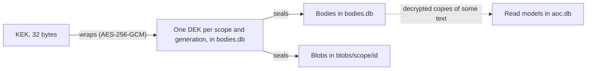

# Runbook: key custody, backups and crypto-shred (R6)

- **Risk:** R6, High. The audit log and the encryption keys are a single point of total data loss, and they must
  be under defined custody before real data lands.
- **Owners:** the platform architect (primary custodian) and the CEO (second custodian).
- **When:** before the first production start (§2, §3), nightly (backups, §4), quarterly (restore drill, §7), and
  whenever an erasure is approved (§6).

## 1. What the keys protect



- The **KEK** (master key) wraps every data key (DEK). Lose it, and every body that has not been erased is
  unreadable for good. Leak it together with `bodies.db`, and every such body is exposed.
- **`aoc.db` is sensitive too.** The chain itself is metadata only, but read models hold decrypted copies of some
  text (ticket descriptions, session titles, decision text). Treat `aoc.db` backups as personal data.
- **Load order** (kernel `loadOrCreateMasterKey`): the `AOC_MASTER_KEY` environment variable, then the file at
  `keys.masterKeyFile`, and otherwise a **newly generated** key written to that path, or to `dataDir/master.key`
  when no path is set (mode 0600, parent directory 0700) — but **only for a data directory that holds no data**.
  If `aoc.db` has events or `bodies.db` has wrapped data keys (or either file cannot be read), aocd stops at
  startup with "refusing to generate a new KEK" and a pointer to this runbook, because a new key cannot unwrap the
  data keys that exist. **With `"mode": "production"`** aocd refuses to start unless the KEK comes from an existing
  `keys.masterKeyFile` outside `dataDir`, mode 0400 or 0600, owned by aocd's user — or a systemd credential in
  `$CREDENTIALS_DIRECTORY` (option 2 below). It refuses `AOC_MASTER_KEY` and never generates a key.

> **The generated key is a development convenience. It is never acceptable in production.** It sits next to the
> data it protects, so any copy of the data directory carries its own key. A mistyped key path, a lost key file or
> a restore without its KEK used to make aocd silently generate a new KEK there, after which every append with a
> body failed, because the existing DEKs could no longer be unwrapped. aocd now refuses instead (development) or
> never generates (production). Starting over on purpose means moving the data directory aside. The pre-start
> check in §3 makes a missing production credential fail before aocd starts.

## 2. Generate the KEK

On the AOC host, as root or the service user, with nothing else logging the terminal:

```bash
umask 077
openssl rand -hex 32 > /etc/aoc/kek          # 64 hex characters = 32 bytes
chown root:root /etc/aoc/kek && chmod 0400 /etc/aoc/kek   # owner = the user aocd runs as
test "$(tr -d '\n' < /etc/aoc/kek | wc -c)" -eq 64 && echo ok
```

With session isolation (credential-isolation runbook §4) aocd runs as root, so root owns the KEK; production mode
refuses a KEK file owned by anyone but aocd's user. The kernel accepts 64 hex characters or the base64 form of 32
bytes. Then set `keys.masterKeyFile` in the aocd
config to the chosen location (§3).

**Escrow** before first use: make one offline copy under two-person control. Either a sealed printout in the
company safe, or a 2-of-3 Shamir split (`ssss-split -t 2 -n 3`) held by the CEO, the platform architect and a
third named officer. Record who accessed the escrow and when, **outside AOC** (a paper log or the company secret
manager's audit log), so that the record does not depend on the system the key protects.

## 3. Store the KEK: options, weakest to strongest

| Option | How | Notes |
| --- | --- | --- |
| **1. A file, mode 0400** (the minimum for production) | `keys.masterKeyFile: /etc/aoc/kek`, owned by the service user, **outside `dataDir`**, on a volume that the data backups do not include | Simple. Root, and anyone who can read the service user's files, can read it. That is why agents must run as a different OS user (threat model O-1) |
| **2. An OS secret store** | **Linux/systemd:** seal it with `systemd-creds encrypt --name=aoc-kek /etc/aoc/kek /etc/credstore.encrypted/aoc-kek` (bound to the TPM2 or host key), shred the plaintext, and add `LoadCredentialEncrypted=aoc-kek:/etc/credstore.encrypted/aoc-kek` to the unit. Set `keys.masterKeyFile` to `/run/credentials/aocd.service/aoc-kek` (`$CREDENTIALS_DIRECTORY/aoc-kek`) | The plaintext lives only in a non-swappable, service-private mount. Recommended default for Linux production hosts |
| **3. KMS or HSM** | Keep only a KMS-wrapped copy of the KEK (AWS KMS, Google Cloud KMS, Azure Key Vault, or an HSM). An `ExecStartPre` step decrypts it into `/run/aoc/kek` (tmpfs, mode 0400, owned by the user aocd runs as). The host identity is the only principal allowed to decrypt | Every decrypt is logged by the KMS: an independent trail of key use. Keeping the KEK inside the HSM for every unwrap would need kernel support that does not exist |

**Do not use `AOC_MASTER_KEY` in production** — `"mode": "production"` refuses it. Child processes inherit
aocd's environment: the kernel's git wrapper now passes only an allowlist, but other helpers (the anchor git push,
the claude CLI LLM adapter) still get the whole environment, so an environment-borne KEK can leak into them (threat
model O-13, gap G-46). Keep it in a file.

Production mode already refuses to generate a key. An extra pre-start check in the unit (systemd drop-in) makes a
missing credential fail before aocd starts:

```ini
[Service]
ExecStartPre=/usr/bin/test -s %d/aoc-kek
```

For option 1, use the file path instead.

## 4. Backups (off-host, nightly)

**aocd does steps 1–3 itself** once `audit.backupKeyFile` is set: a daily, consistent, encrypted backup of `aoc.db`,
`bodies.db`, `blobs/`, `anchors/` and the evidence packs (never the keys), recorded as `backup.completed` and restored
with `aocd restore`. Setup, monitoring and the restore procedure are in the
[backup and restore runbook](backup-restore.md). Step 4 still needs its own copy, and the manual steps stay valid
for a copy taken by hand, for example with aocd stopped.

Back up the data and the keys **separately**: different media, different custodians. A backup that contains both
`bodies.db` and the KEK is a copy of all your personal data in clear, and it also defeats crypto-shred (§6).

**What to back up, in this order** (a body is written before its event commits, so this order guarantees every
event in the copy has its body):

1. `aoc.db`: an online, consistent copy. Never a plain `cp` while aocd runs, because the `-wal` file holds
   committed data:
   ```bash
   sqlite3 /var/lib/aoc/data/aoc.db ".backup '/backup/stage/aoc.db'"
   ```
2. `bodies.db`, the same way:
   ```bash
   sqlite3 /var/lib/aoc/data/bodies.db ".backup '/backup/stage/bodies.db'"
   ```
3. `blobs/`. Files are immutable and named by id: `rsync -a /var/lib/aoc/data/blobs/ /backup/stage/blobs/`.
   Copy `anchors/` (RFC 3161 records and tokens) the same way when that provider is used.
4. Governed config: `config/` (registry, rate card, ISO mapping) and the aocd config file. The external
   self-modification log too, unless it is already shipped off the host as it is written (gap P-07).
5. **Not** the credential profiles file, and **not** the KEK. They go in the secret store and the escrow (§2, §3).

Then:

- Encrypt the backup set at rest with a backup key that is **different from the KEK**. `aoc.db` holds plaintext
  copies of text, so the backup is personal data. Ship it off-host to storage the AOC host cannot delete (object
  lock or WORM where available).
- Run the backup **after** the scheduled anchor job, so the newest backup is covered by an off-host anchor.
- **Retention** is part of the PDPA erasure promise (§6). Set it as a CEO decision (threat model O-12), for example
  35 days.
- Monitor it: alert if the nightly backup is missing or if it is smaller than the previous one by more than an
  agreed margin.

## 5. Rotation

| What | Status | Procedure |
| --- | --- | --- |
| **KEK** | **No tool yet** (threat model O-23) | Rotation means unwrapping every DEK row in `bodies.db` (`body_keys`) with the old KEK and re-wrapping it with the new one. Bodies are untouched; key ids, and with them the AAD, stay the same. The required offline tool must: stop aocd; back up `bodies.db`; re-wrap every non-destroyed key row in one transaction; verify by decrypting a sample of bodies and blobs; swap the KEK file; start aocd; and keep the old KEK in escrow until every backup made with it has expired |
| **DEK** | Implicit | DEKs are per scope; a new generation starts only after a scope is erased. A leaked DEK exposes only its own scope |
| **Backup key** | Ops | Rotate yearly; re-encrypt or let expire the backups made with the old key |
| **Credential profiles** | Ops | See the [credential isolation runbook](credential-isolation.md) §8 |

Until the KEK tool exists, rotate only on suspected compromise (§8), with the CEO's approval and with the tool
written and reviewed first. That tool is governance core.

## 6. Crypto-shred

Crypto-shred makes the bodies of one scope unrecoverable while the chain stays valid (ADR-0003). It is irreversible.

**Triggers** (`body.erased.reason`):

- `pdpa_request`: a data subject's erasure request;
- `secret_leak`: a secret captured in a prompt, a tool output or a ticket;
- `retention`: a retention period has expired;
- `other`.

**Approval.** Erasure touches data, so it bounces to the Approver (§6 of the spec). The `audit.erase` permission is
Approver-only.

1. **Identify the scope or scopes.** The `bodyScope` of the affected events:
   - a ticket `tkt_…`: the requester's text and media;
   - a session `ses_…`: prompts and tool summaries;
   - a user `user:<userId>`: the identity events about that person (profile data);
   - a project `prj_…`: shreds every project-scoped body, so use it only if intended;
   - **never `global`**, which is shared by everything without a narrower scope.

   List the affected events with an audit query on the scope id, and read their types.
2. **Assess the impact.** Everything in the scope goes, not only the offending item. The chain still proves that
   each event existed (type, actor, time, ids). Evidence packs show `[erased]` for the text.
3. **Raise a change request** (scope `data`) naming the scope ids, the reason, the impact, and the backup
   retention date that will complete the erasure. Whoever submits it cannot approve it, so while the CEO is the
   only Approver, a Builder (or the DPO's delegate) submits it.
4. **The Approver approves.** Record the decision id.
5. **Execute** the erasure: `POST /api/audit/erase {scopeId, reason, decisionId}` (permission `audit.erase`,
   Approver only; `reason` is one of the four triggers above). It destroys every DEK generation of the scope,
   deletes the ciphertext rows and blob files, checkpoints `bodies.db`, lets every projector scrub its copies
   (`onErase`), appends `body.erased {scopeId, reason, erasedBy, bodyCount, decisionId}`, and answers with the
   number of bodies erased and of events in the scope. **Always pass the approved change request's decision id.**
   The API accepts an erasure without one, and checks only that a given decision is resolved, not that it
   approved this erasure (threat model O-28): the procedure, not the code, ties the two together.
6. **Close the `aoc.db` gap** (until threat model O-24, gap G-39, is fixed): in the next maintenance window, run
   `PRAGMA wal_checkpoint(TRUNCATE)` and then `VACUUM` on `aoc.db`, with aocd stopped, so that overwritten
   read-model text does not linger in free pages.
7. **Verify:** the events of the scope read back with `payload: null`; the affected views show `[erased]`; the
   scope's blob directory is gone; Verify still passes.
8. **Backups.** The erasure is complete only when every backup taken before step 5 has expired. Put that date in
   the response to the data subject.
9. **For a secret leak, also rotate the secret.** Erasure does not un-leak it: the model saw it, and the provider
   and anyone else who received it may still hold it.

## 7. Restore drill (quarterly)

With aocd's own backups, follow [backup and restore §6](backup-restore.md#6-quarterly-restore-drill): `aocd restore`
performs the checks of step 4 before it installs anything. For a backup set taken by hand:

1. Take the newest backup set, the backup key, and the KEK from escrow (two-person rule).
2. Restore onto an **isolated** host with no network path to GitHub or the production anchor remote. Read-only
   access to the anchor remote is fine.
3. Start aocd with the restored data and KEK, with every outbound job switched off: `fx.enabled: false`,
   `audit.anchorProvider: none`, no `decisions.webhookUrl`, and no claude binary on the path. Nothing should reach
   the outside world or launch a session.
4. **Verify:**
   - the chain verifies end to end;
   - the recomputed hashes match every off-host anchor up to the backup time;
   - an anchor **newer** than the backup shows how much would have been lost (the recovery point);
   - a sample of bodies and blobs decrypts;
   - `projection_health` is clean;
   - a test rebuild of the projections finishes.
5. Record the recovery time (from the start of the restore to Verify passing) and the recovery point (the age of the
   backup). Attach both to the next evidence pack.
6. Destroy the drill host's copy, and return the KEK to escrow.

## 8. Loss and compromise

| Event | What happens | Response |
| --- | --- | --- |
| **KEK lost**, escrow intact | aocd does not start: production names the missing KEK file, development says "refusing to generate a new KEK". (With a *wrong* KEK in place, aocd starts but every append with a body fails: the existing DEKs cannot be unwrapped) | Restore the KEK from escrow; investigate why the file vanished |
| **KEK lost, no escrow** | Every body is permanently unreadable, which is the same as shredding everything. The chain still verifies | Incident. Do **not** rebuild projections: the read models still hold decrypted copies, and a rebuild would replace them with `[erased]`. Decide with the CEO what to export from the read models |
| **KEK suspected compromised** | Combined with `bodies.db`, all unerased bodies are exposed | Incident, plus a PDPA breach assessment. Rotate (§5), restrict host access, review who could read the KEK and `bodies.db` |
| **`aoc.db` lost or corrupted** | No chain, no read models | Restore the newest backup; compare with the off-host anchors. The anchors prove which events existed after the backup, so record the gap as an incident |
| **`bodies.db` lost** | The chain verifies; the bodies are gone | Restore `bodies.db` from the backup taken right after the matching `aoc.db` |
| **The host is lost** | Everything on it | Rebuild the host; restore (§7 procedure, on production); re-issue the session and observer ingest tokens |
